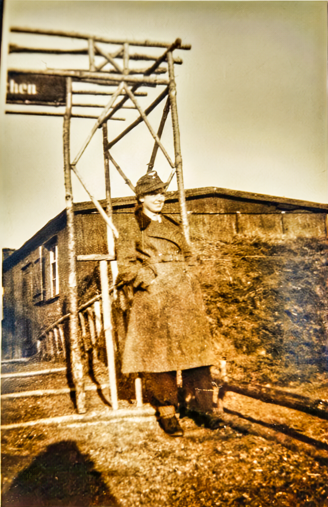
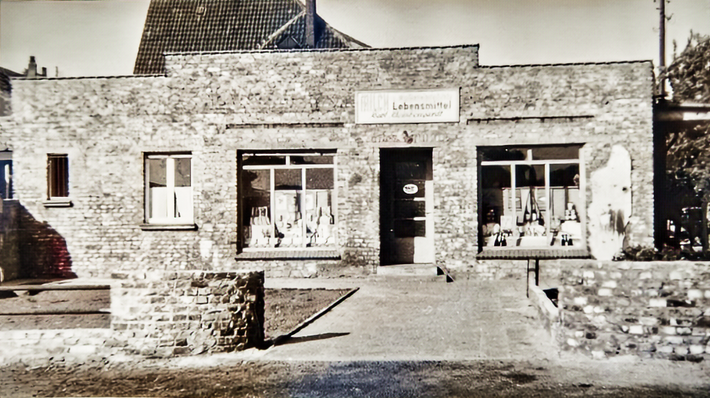

# Oma Elsbeth

Wollt Ihr meinen "Roman" lesen?

Ich beginne mit meinen ersten Erinnerungen.

Wie hat Michael in seinem ersten Lebenslauf für die Schule geschrieben?

Der Baumeister Wilhelm Hilker und seine Ehefrau Elsbeth geb. Kleinbongardt entpuppten sich als meine Eltern.

Meine Eltern "entpuppten” sich als, Elisabeth, geb. Voß und Karl Kleinbongardt.

Mein Geburtshaus stand in Fahrn, ehemalige Bauernschaft, von Hamborn, im schönen Kohlenpott". Fahrn nannte sich auch die "Fröhlichkeit", genannt nach einer Gastwirtschaft gleichen Namens. Dem Erzählen nach war ich ein Dünnes Mädchen mit Beinen wie Streichhölzer nach Vaters Aussage. Wir bewohnten eine Etage, und zwar die Unterste im Haus Frundsbergstraße (Karl Wilhelm Steff). Mir kam mein Zuhause immer riesig vor. Über uns wohnte Onkel Heini, Tante Male, Friedhelm und Lydia. Friedhelm war ein behinderter Vetter und Lydia eine sehr helle Cousine. Ich glaube, wir haben uns manchmal ganz fürchterlich gezankt, zum Kummer meiner Mutter. Lydia nahm es mit der Wahrheit nicht so ganz genau und war ganz schön katzig. Meine arme Schwester Ruth ließ sich immer alles gefallen. Dann hatten wir einen Hof mit Kopfsteinpflaster und wenn es Opa Kleinbongardt einfiel, mussten wir Kinder das Gras aus den Fugen zupfen. Eine Arbeit, die wir nur widerwillig auf uns nahmen. An den Hof schloss sich Opa Peters Reich an. Wir Kinder waren dort nicht gern gesehen.

// ### TODO

Den Rosengarten gab es auch noch. Für Kinder Verboten. Ausser vielleicht mal promeniert mit Puppenwagen und in ...

Es wurde immer alles Verschönert und gestrichen. Es genügte nicht, dass der Zaun grün gestrichen wurde, er bekam auch noch weiße Spitzen. Die Gartenlaube, ein geheiligter Ort, war Oma und Opa vorbehalten. Opa ließ sich darin sonntags in schwarzer Jacke nieder. Auf dem Bild seht ihr eine der wenigen Ausnahmen.

Jeder Nagel hatte seinen Platz. Die Schuhe durften nur an einem bestimmten Platz geputzt werden, usw.

Einmal im Jahr feierte Opa anlässlich seines Geburtstages ein Familienfest mit seinen Brüdern, Schwestern und alten Verwandten. Ich glaube, dann hätte er uns Enkelkinder am liebsten wer weiß wohin geschickt. Das ganze Jahr sammelte Opa kleine Flaschen, Konservendöschen und dann wurde ein Schießstand aufgebaut und wie doll geschossen. Zum Entsetzen aller Erwachsenen krochen wir Kinder auf dem Boden zwischen ihren Beinen herum, um die leeren Patronenhülsen zu ergattern. An Oma habe ich nicht so viele Erinnerungen. Die kommen erst später.

Für meine Mutter war sie eine gefürchtete Schwiegermutter. Oma legte immer großen Wert auf Etikette. Mutter sollte sich im Haus immer schick anziehen mit weißen Schürzen. Dabei meinte Mutter immer, aus Sparsamkeitsgründen im Haug alles auftragen zu müssen.

Einmal in der Woche kam unsere später so dicke Tante Lydia, bewaffnet mit einer großen Kuchenplatte, vom besten Konditor der Stadt.

Sie machte immer einen großen Umweg, sogar mit der Straßenbahn. Das war nichts für Oma Auguste. Dafür fehlte ihr jedes Verständnis. Schon wegen des Geldes. Aber Tante Lydia ließ sich nicht beirren, es war schließlich ihr Geld. Unsere Mutter hätte es sich auch nicht geleistet. Auf jeden Fall schön für uns Kinder, der Tisch wurde schön gedeckt und der Kaffee gekocht. Oma kam quer über den Hof in Sicht. Mutter sah Oma, die Kuchenplatte verschwand unter dem Sofa. Dieses war ein Werk von Sekunden. Als Oma die Küche betrat, saßen Mutter und Tante Lydia vor einer Leeren Kaffeetafel, ganz harmlos. Oma schnüffelte und roch den guten Bohnenkaffe und zog wieder ab.

Und dann wurden wir Kinder in die äußerste sicherste Ecke unseres Hofes geschickt, wenn die Pferde angespannt wurden. Sie es vor den Milchwagen oder den Fuhrwaqen. Ganz schwach kann ich mich erinnern, dass an unserer Ecke mal ein Vierspänner mit einem großen Planwagen auf ein Schaufenster zuraste. Mutter schrie laut auf und wir drückten uns an einen Zaun. Bis heute habe ich trotz meiner großen Reiterfamilie die Angst vor Pferden nicht ganz verloren.

Bei schönem Wetter machten wir einen Spaziergang nach Oma und Opa HoIten. Ich habe den Weg als eine große Wanderung in Erinnerung. Es ging über Feldwege und Büsche. Ein bisschen von dem Grünen ist heute im Revierpark erhalten geblieben. Wir schoben den Kinderwagen und pflückten Blumensträuße zum Ergötzen von Tante Lydia. Es war in ihren Augen natürlich Unkraut und schon leicht verwelkt, bis wir bei ihr ankamen. Opa Holten war ein freundlicher, friedliebender Mann. Tante Lydia, unverheiratet, hatte das Zepter in der Hand. Sie ärgerte sich immer über "Moder“. Moder war die dritte Frau von Opa Holten und ein Fall für sich Der Großvater hat sich ja auch schon über Tante Lydia geärgert. Erstens war sie immer in Eile, um was Gutes zu tun. Im Zusammenhang mit ihr habe ich oft das Sprichwort gehört, dass ein Mann nicht so viel verdienen kann, wie eine Frau in der Schürze wieder heraustragen kann. Zweitens war sie nicht mehr zu halten, wenn die Zeit der Bibelstunde kam. Dann flog ihre Schürze in die Ecke und weg war sie. Später zog sie mit jeder Beerdigung, um den verstorbenen Bruder auf seinem erfreulichen letzten Weg zu begleiten. Er wurde von ihr beneidet, weil er ja schon beim Herrn und Heiland war. Noth viel später hat sie sich aus dem Fenster gestürzt. Alle Ihre Kinder vermuteten, dass sie endlich beim Herrn und Heiland sein wollte.

Wie es auch sei, wir setzten uns erst mal nach dem weiten Weg zur Stärkung an den Kaffeetisch. Es gab Malzkaffee und Butterbrote mit selbstgemachtem Johannisbeeregelee. Dieser war aber nicht zu halten, er lief uns. wie Saft Über Finger und Kleider. Es war eine fürchterlich klebrige Angelegenheit. Opa war in unseren Augen immer lieb und freundlich. Dabei hatte er in seinem Leben, was Ehe und Liebe anbetraf, keine Glückssträhne erwischt. Seine erste Ehefrau war Elise Knüfermann. Euch durch das Foto in unserer Diele bekannt. Nach Opas Aussage war Elisabeth sehr liebebedürftig, zart und eine tüchtige Schneiderin. Bei der Geburt Ihrer dritten Tochter, Lydia, starb sie nach 4-Jähriger Ehe an Wochenbettfieber. Opa heiratet wieder und bekam wieder zwei Kinder, von denen eins starb und kurze Zeit später seine zweite Frau. Nun war er wieder Witwer mit 4 kleinen Kindern. So musste er sich ja wohl wieder eine Frau suchen. Dann kam eben die wunderliche Ida. Aber das Glück und der Frieden kehrte mit dieser Frau nicht in die Familie ein. Sie bekam auch noch mal drei Kinder. Aber alle Nachkommen von Opa werde ich noch genauer beschreiben. Sie gehören zu meinen wunderlichen Kindheitserinnerungen. Trotz allem war Opa Holten nie verbittert, und hat alles durch seinen starken Glauben ertragen können. Er ist 80 Jahre alt geworden.

Und nun zurück zu unseren “Ausflügen” nach Holten. Opas Haus war für mich das Schönste weit und breit. Es war gelb gestrichen, wie man früher sagte, mit Ölfarbe. Die Fenster waren mit roten Ziegeln eingefasst, es gab ein Türmchen und Erker. Aber was mir erst viel später auffiel, im ganzen Haus gab es keine Wasserleitung und eine Toilette schon gar nicht. Leider ist auch dieses Haus durch Bomben zerstört worden.

Über die Familie Voß gäbe es viel zu erzählen. Ich will es so kurz wie möglich machen. Für euch ist es vielleicht gar nicht interessant. Aber zu meiner Kindheit gehört es eben. Im Hause Voß gab es nun 7 Kinder von drei Müttern. Die drei ältesten waren Elisabeth, eure Oma, Martha und Lydia. Sie hatten als Großeltern und Mutter die Familie Knüffermann, von der Mutter ja so viel erzählt hat. Für mich wurde sie auch noch ein Begriff und selbst ihr, Elisabeth und Margret kennt sie noch. Die Familie Knüffermann war für die damalige Zeit recht wohlhabend. Wenn wir als Kinder zu ihnen nach Hochfeld eingeladen wurden, war es ein Fest. Eine Tante hatte ein ganz vornehmes Café. Wir nahem im Café Platz und bekamen die herrlichsten Sahnetörtchen vorgesetzt geschmückt, mit bunten Papierschirmchen. Bis heute finde ich sie schön. Die andere Tante besaß ein Feinkostgeschäft, Tante Berta und Onkel Bernhard. Ich weiß noch ganz genau, wie der Laden aussah, Schränke, Schubladen, Glasvitrinen aus dunklem Holz bis unter die Decke. Weißblaue Fliesen auf dem Boden und hinter der Theke Holzlattenroste, damit die Verkäuferinnen keine kalten Füße bekamen. ln der Wohnung standen dicke Ledersessel und große Bücherschränke. Onkel Bernhard einen Wintergarten mit einer Kakteensammlung. Das alles ergab für mich eine Stimmung, die mir sehr behagte. Nur die Umgebung gefiel mir nicht so sehr. Es war ein fünfstöckiges Haus in einer völlig geschlossenen Häuserfront in Duisburg Hochfeld. Am Ende der Straße überragten die hohen Schornsteine der Kupferhütte das Straßenbild und verpesteten die Luft. Ihren Lebensabend verbrachten Tante Berta und Onkel Bernhard in Wiesbaden. Genau so gerne wie ich als Kind nach Tante Berta in Hochfeld fuhr, so gerne besuchte ich sie auch noch als verheiratete Frau in Wiesbaden. Sogar mein Mann steuerte gerne Wiesbaden an.

Zurück in die Erinnerungen: Es gab dann eine Zeit, in der nicht mehr gerne nach Hochfeld fuhr. In der Nazizeit schimpfte Onkel Bernhard immer fürchterlich über Adolf Hitler. Wenn es eben ging, hockte er, unter einer Decke versteckt vor dem Radio und hörte „feindliche Sender“. Mutter hatte immer Angst, dass er verraten wurde und die SS erscheinen könnte, um ihn in unserer Anwesenheit zu verhaften.

Er hat aber alles überlebt und ist 80 Jahre alt geworden.

Die zweitälteste war Martha. Ich kenne sie nur vom Erzählen. Sie ist als junges Mädchen und Braut ihrem Bräutigam Fritz Aderhold als Missionsfrau nach Afrika gefolgt. Sie ist bald an Heimweh gestorben und freute sich nach der Geburt von drei Hindern so sehr wieder auf zu Hause. Sie starb dann noch in Afrika an einer Tropenkrankheit. Dem Typ nach war sie wohl wie unsere Oma Elisabeth. Fritz Aderhold habe ich später kennengelernt. Er war ein Frömmler und verabschiedete sich mit den Worten: Auf Wiedersehen droben im Licht.

Die dritte war Tante Lydia. Als junges Mädchen war sie richtig hübsch. Groß, schlank, schwarze Locken. Sie war verlobt, das Verlöbnis ging auseinander, zum schrecklich großen Kummer von Tante Lydia. Aus Liebeskummer begann dann sie wohl sich "Kummerspeck“ anzuessen. Bevor es ganz schlimm wurde, hat sie sich "Ihr Hermännchen" eingefangen. Onkel Hermann war ihr in Jeder Hinsicht unterlegen, 7 Jahre jünger. Zu Ihrem großen Glück fehlte jetzt nur noch ein Kind. Es kam, als sie 42 Jahre alt war. Onkel Hermann kam 80 Pfund schwer, aus russischer Gefangenschaft heim und wurde nun von Tante Lydia mit Riesenmengen Bratkartoffeln und Milchsuppe "fett Gefüttert". Tante Lydia war in ihrem Element. Die Qualität ihrer Küche wurde besser, aber die Menge nicht kleiner. und so kam es wie es kommen musste, sie brachten zusammen eine ganz hübsche Summe Kilogramm, bzw. Zentner auf die Waage. Aber trotz allem machten wir sie immer gut leiden, schon wegen des Humors und ihrer Gutmütigkeit, die sie uns vermittelte.

Das vierte und einzige Kind aus 2. Ehe war Onkel Johannes. Er ging in dem Trubel immer ein bisschen unter. Nur später erschien er in der Familie Kleinbongardt, aber davon später im Zusammenhang mit Opa Marls Schwester.

Jetzt kennen wir ihn alle nur als Totengräber“.

Und dann die drei Kinder von "Oma Ida".

Als Erstes Hanna. Sie heiratete Fritz Gissel. Auch sie folgte Ihrem Bräutigam als ganz junges Mädchen nach Afrika. Mit unserer Verwandtschaft in Afrika konnten wir in der Schule immer herrlich angeben. Wir schmückten und mit Armbändern aus Elefantenhaar und Muschelketten und nahmen sogar die Fotos mit. Tante Hanna und Onkel Fritz Sind Afrika treu geblieben und betreuen jetzt noch ihre "Bekehrten in der dritten Generation. Heute, über 80 jährig, nun als Witwe, macht sich Tante Hanna immer noch unternehmungslustig wie früher, auf den Weg nach Afrika, obwohl, nach ihrer eigenen Aussage die Luft manchmal recht "eisenhaltig“ ist und die Gefahr, von räuberischen Somalis im Pokomoland überfallen zu werden, sehr groß ist. Ihre fünf Kinder, nun schon lange erwachsen, sind irgendwie zwischen Missionstätigkeit und Vortragsreisen, aufgewachsen und machen zum Teil auch ihren etwas außergewöhnlichen Lebensweg.

Auf jeden Fall sind dann auch noch die jüngsten Söhne dieser Familie zu erwähnen. Paul und Karl, zwei ganz wilde Burschen. Beides "germanische Typen“, über 1,80 groß, stark, beide SS Soldaten, beide aber früh gestorben. Paul hatte es mit Bräuten, zum Entsetzen von Tante Lydia. Sie musste sie immer beköstigen, einschließlich Hochstaplerin. Bis dann die Richtige kam und ihn bändigte. Er bekam fünf Kinder und endete als ziemlich trunksüchtiger Trinkhallenbesitzer.

Karl, mein jüngster Onkel, sieben Jahre älter als ich, hatte keine Nachkommen. Er heiratete eine nette, liebe, "wohlbegüterte“ Frau. Lag mit noch nicht fünfzig Jahren mit einem amputierten Bein im Krankenhausbett mit dicken Zigarren und Weinbrand. Er bekam Besuch von seinen alten Kameraden aus der Waffen-SS und Hitler Leibstandarte und sie träumten von vergangenem Glanz, die alte Herrenrasse.

Das in Kürze über die Familie Voß. Über die Vettern und Cousinen zu berichten, führte zu weit. Ich habe auch kaum noch Kontakt. Altermäßig gehörte ich auch mehr zu Tanten und Onkeln. Der besagte "Onkel Karl“ hat mir mal prophezeit, dass ich wegen meiner lang behaarten Arme und Beine mal einen reichen Mann bekäme. Und er konnte absolut nicht vertragen, wenn er in seiner schicken, schwarzen SS Uniform vor mit Stand und ich als munterer "Backfisch“ ihn mit Onkel anredete. Er hat es sich energisch verbeten.

Tante Lydia erzählte, dass sie als junges Mädchen "in Stellung", einmal im Jahr ihren Lohn ausgezahlt bekam. Es war Inflationszeit und sie konnte für ein Jahr Arbeit gerade einen Regenschirm kaufen und war auch noch stolz darüber. Diese Geschichten waren für mich Viel interessanter, als auf kleine Vettern und Cousinen aufzupassen. Ich wäre schon so gerne erwachsen gewesen.

Soviel über die Familie Voß. Opa Karl sprach immer etwas geringschätzig von den „Voße Köppen“.

Und nun zu der "Sippe" Kleinbongardt.

Oma Auguste hat neun Kinder geboren. Drei sind ganz klein gestorben. Die Todesursache ist mir nicht bekannt. Nur von einem kleinen Sohn weiß ich es aus Erzählungen, die mich schon als kleines Mädchen sehr traurig stimmten. Der kleine war aus Angst vor einer Friseurschere weggelaufen und irgendwo im Bach ertrunken. Die Nachbarn brachten Ihn der Oma tot ins Hause Oma konnte noch nicht einmal im hohen Alter gut darüber sprechen. Der älteste war Onkel Heini, verheiratet mit Tante Male. Sie wohnten in einem Haus mit uns. Dadurch waren auch seine zwei Kinder, Friedhelm und Lydia unsere Spielkameraden. Friedhelm war behindert, wie man heute sagt. Er wurde von seiner Mutter, Tante Male, liebevoll betreut. Heute stände sie nicht so ganz alleine damit. Auf jeden Fall hat Friedhelm sein ganzes Leben schwer gearbeitet und sich seine Rente verdient. In den Nazi Jahren, als alles nicht lebenswertes Leben ausgelöscht wurde, ließ Tante Male ihren Sohn nicht aus den Augen. in Hohem Alter, als Onkel Heini schon tot war, bekam sie den Lohn für alle Mühen. Friedhelm passte auf seinen etwas verwirrten Vater auf, trug seiner Mutter das Handtäschchen, putzt Staub und versorgte sie rund um die Uhr. Friedhelm war 65, als er zum größten Kummer von Tante Male starb. Tante Male wurde über 90 Jahre alt. Onkel Heini und Opa Karl haben sich wohl aus brüderlicher Liebe bis ins hohe Alter fürchterlich gezankt. Vielleicht auch, weil sie einfach in zu enger Nachbarschaft wohnten. Tante Male und Oma Elisabeth hielten die verwandtschaftlichen Beziehungen geduldig und ausgleichend aufrecht.

Die jüngere Schwester von Opa Karl war Tante Hanna.

Ihre Geschichte:

Sie heiratete Johannes Voß, den Halbbruder von Oma Elisabeth.

Es war ihre erste große leidenschaftliche Liebe. Onkel Hannes war wohl auch etwas unberechenbar in seiner ersten Liebe und machte sich manchmal zum Gespött seiner jugendlichen Freunde und jüngeren Brüder. Sie bewarfen seine auserwählte mit Schneebällen. Hannes wehrte sich entrüstet und rief: „Bitte belästigen sie meine Dame nicht.“ Er schlief draußen im Garten am Haus, um seinem Hannchen näher zu sein. Abends bekam Hannchen, nach einem anstrengenden Waschtag, zum Gaudi seiner Geschwister sämtliche Sofakissen aufs Sofa gelegt. Vater richtete ihnen ein Lebensmittelgeschäft ein, zumindest half er ihnen. Der erste Sohn Peter wurde geboren. Abends kam eine Musikkapelle und brachte der Wöchnerin ein Ständchen. Die große Liebe verging. Lag es am Krieg? Onkel Hannes wurde Soldat. Er schaffte sich eine Freundin an. Sie bekamen noch eine Tochter. Aber es half alles nichts. Die Ehe wurde geschieden. Es spielten sich Dramen in der Familie Kleinbongardt und Voß ab. (Mir heute sehr verständlich). Nach einigen turbulenten Jahren heiratete sie dann Hans Schlag. Hans Schlag war sieben Jahre jünger. Er kam durch mich in die Familie. In den Hungerjahren nach dem Krieg stand in den Schlangen vor unserem Geschäft eine bedauernswerte Gestalt. Hans Schlag sah zum Umfallen aus. Er kam aus der Gefangenschaft aus dem Lazarett. Behindert und verhungert. Ich half ihm so gut wie möglich, in dem ich bestimmte Waren und Lebensmittel, besonders Milch, für ihn verwahrte, damit er nicht mehr stundenlang bei Wind und Wetter in der Schlange stehen musste. Er war so munter und unterhaltsam, dass ich Ihn auch später zu meiner ersten Fete einlud. Er gestand mir, dass er am liebsten eine Kriegerwitwe heiraten würde, die wenigstens schon eine Wohnung hätte. Mit einer jungen Frau, kleinen Kindern und Existenz Gründung wäre er wohl überfordert. Also war Tante Hanna die Richtige. Allen Unkenrufen der Kleinbongardts haben sie eine mustergültige Ehe geführt. Man konnte sich an ihnen erfreuen. Nur Oma Auguste wollte, dass ich nun auf einmal „Onkelt“ zu ihm sagen sollte. und da habe ich gestreikt. Er wäre ja sogar ein Heiratskandidat für mich gewesen.

Der vierte der Geschwister Kleinbongardt, Onkel Willi:

Soweit ich ihn Erinnerung habe, und dass sehr gut, war so ein bisschen wie man sagt. ein "Hans Dampf" in allen Gassen. Von Opa Karl weiß ich, dass in jungen Jahren seine Motorräder kaputtgefahren hat. Er selbst konnte sich keine Leisten. Er war in einer Kaufmännischen Lehre. Er wurde arbeitslos. Es waren die schweren Jahre um 1930. Also half er meinem Vater im Milchgeschäft. Neben Vaters Milchwagen, ein Pferdegespann, wurde ein Dreirad angeschafft, mit dem Onkel Willi in der Kundschaft herumfuhr. Ob er als Lohn die Motorräder erhielt, oder sich selbst zusammensparte, wer weiß es noch. In diesem Jahre muss er auch schon in der SS gewesen sein. Das war genau das Richtige für sein Temperament. Was wurde sonst noch für die Jugend geboten? So war er dann mit seinen Freunden abends unterwegs zu irgendwelchen Saalschlachten und Raufereien. Von ihm kenne ich auch den Schlagring. Ich kann diese gefürchtete Waffe schlecht beschreiben. Auf jeden Fall konnte man damit recht gut Zähne einschlagen. Eines Tages stellte er der Familie seine Freundin Betty als Heiratskandidatin vor. Opa Peters Kommentar. die kommt mir nich auf den Hoff. Aber die Hochzeit fand statt. Onkel Willi war inzwischen Zollbeamter und machte Dienst an der holländischen Grenze in Straelen. Er bekam zwei Töchter. Aber ohne Fahrn konnte er nicht qut auskommen. Einmal in der Woche kam er mit einem Motorrad mit Seitenwagen, noch von Opa Karl gekauft, angebraust. Er wurde von uns Kindern mit großem Hallo empfangen und meine Mutter kochte ihm einen großen Topf Milchsuppe. Eines Tages wurde ich in den Seitenwagen gepackt und fuhr in die Ferien nach Straelen. Meine Mutter hat bestimmt tausend Ängste ausgestanden. Onkel Willi fuhr bekannterweise nicht gerade langsam.

Im Krieg hielt er unserer Mutter die Treue. Mutter verwöhnte ihn gerne weiter mit Bratkartoffeln und Milchsuppe, weil er auch so große Ähnlichkeit mit Vater hatte. Auch er wurde Soldat und machte Dienst bei der Waffen SS. Auch er kam in der damals so gefürchteten schwarzen Uniform. Am Ende des Krieges kam er in amerikanische Gefangenschaft und wurde entnazifiziert. Vorher verhört. Und das war wohl eine schlimme Tortur. Der ganze Hass war ja 1945 - 1947 noch am größten und fanatischsten. Er ist aber heil herausgekommen, weil er nachweisen konnte, dass er vielen Juden über die holländische Grenze zur Flucht verholfen hat. Dann wurde auch seine Ehe geschieden, das nächste Drama in der Familie Kleinbongardt. Seine nächste Heiratskandidatin war Anni, katholisch, und damals eine schwierige Situation. Mit viel Theater, auch in unserer evangelischen Familie; Oma und Geschwister wurden vor die katholische Kirche als Zeugen geladen. Die Ehe wurde annulliert. Stand aber unter keinem guten Stern, dafür waren beide zu extrem. Sie rieben sich untereinander auf. Aber trotz allem war er für mich ein ganz lieber Onkel, der uns auch oft hier in Oelde besuchte. Die fünfte im Bunde: Tante Guste. Ihre Hochzeit war für uns ein Ereignis. Wir bekamen weiße Musselinkleidchen mit roten Röschen genäht. Bis dahin war Tante Guste gar nicht so für mich in Erscheinung getreten. Alle waren glücklich über ihre Wahl, Onkel Hermann war so der von allen akzeptierte Kandidat für Tante Guste. Die Hochzeit verlief abends etwas außergewöhnlich für die Gäste. Um 9 Uhr erschien Onkel Hermann in brauner Uniform mit Marschgepäck, um seinen 30 km Nacht Gepäckmarsch für das SA - Goldene Sportabzeichen anzutreten.

Das junge Paar bezog eine Wohnung in Essen Stadtwald und ich durfte sie dann manchmal besuchen. Wir machten Spaziergänge zum Baldeneysee mit Blick auf die Villa Hügel. Wenn die schwarz-weiß-rote Fahne und die Fahne der SA dort flatterte, war der Führer dort in seinem Domizil. Wenn Tante Guste mich abends ins Bett brachte, sagte sie zu Onkel Hermann, er solle mich mal fotografieren und mein Bild an die Zeitung schicken als Reklame für die hungernde Jugend Deutschlands. Tante Guste hat in den Kriegsjahren dann vier Kinder in drei Jahren zur Welt gebracht. (Zwillinge) Sie hat durch Evakuierungen usw. wahre Odysseen erlebt und mitgemacht. Heute erzählen wir noch oft davon. Vielleicht könnte sie viele meiner Erinnerungen revidiert, zumindest von ihrem Standpunkt und Erinnerung anders sehen. Und wie sagt sie heute, abgesehen von den ersten Jahren bedingt durch den Krieg, ist ihr Leben doch recht geordnet und ruhig verlaufen.

Die Jüngste im Bunde Kleinbongardt ist Tante Mia. Sie ist nur sieben Jahre älter als ich. Als kleines Mädchen durfte ich nur mit ihr und ihren Freundinnen spielen, wenn ich Tante zu ihr sagte. Später, als wir zur gleichen Zeit heirateten und auch zur gleichen Zeit unser erstes Kind erwarteten, sollte ich unbedingt die "Tante" weglassen. Auch sie brachte ein wenig Aufregung in die Familie Kleinbongardt. Ihre einzige Tochter "musste" mit 16 Jahren einen Koreaner heiraten. Es war ein Familienskandal. Aber zum Erstaunen aller Großmäuler entwickelte sich eine vorbildliche Familie. Herr Li ist vollkommen integriert und lebt mit seiner Frau Adelheid, Tochter Corinna und Tante Mia glücklich zusammen.

Alle diese Tanten und Onkel lebten in Hamborn und lebten mehr oder weniger im großen Familienbund und gehörten zu meiner Kindheit. Für mich gehörten alle zu meinem Leben und ich saß als kleines Mädchen immer dazwischen mit großen Augen und neurigen Ohren, die mehr hörten, als ihnen manchmal lieb gewesen wäre.

Jetzt beginnen meine etwas bewussteren und geordneten Erinnerungen. Vater und Mutter, für Euch Opa Karl und Oma Hamborn.

Sie waren für mich so ein verliebtes und strahlendes Ehepaar. Ich glaube auch, nicht nur für mich. Vater war für uns, trotz aller Liebe, die er uns zeigte, auch eine Respektsperson. Mutter war immer lieb und so gar nicht energisch. Für sie gab es nur ihren Karl, "den einzigen". Viel Zeit hatte Vater für uns nicht. Dafür war Mutter den ganzen Tag für uns da. Aber zu sagen hatte sie nichts. wollte aber es auch nicht. Nur der Sonntag gehörte uns allen. Dann gingen wir spazieren. Vater spielte und tobte mit uns herum, was Mutter wegen ihrer großen Ängstlichkeit immer nervös machte. Ganz selten holte Vater auch mal die Kutsche von Opa Holten. Opa Holten besaß einen Schimmel, der wurde angespannt. Er war nicht einer der bravsten. Er war schon mal ausgerissen und über Hecken und Zäune in Nachbars Gärten gesprungen. Für Mutter wieder ein Grund, bange zu sein. Wir Kinder fanden es ganz toll.

Mein treues Anhängsel war meine 2 1/2 Jahre jüngere Schwester Ruth. Ich brauchte nur zu sagen, Ruth, hol mir mal das oder das, sie rannte. Nur einmal sagte sie, ich bin doch nicht dein Hund. Das hat mich dann doch getroffen. Im Kreise meiner Schwestern war ich wohl ein kleiner Außenseiter. Ich war so dünn und schmal und im Sommer braun gebrannt wie ein Neger. Vater und Mutter wurden einmal gefragt, wo sie mich denn aufgelesen hätten. Ganz schlimm war für mich die samstägliche Badeprozedur. Ich bekam den Hals mit Öl eingerieben und geschrubbt. Ruth blond und hellhäutig, Christel rothaarig und Doris wieder blond. Auf jeden Fall glänzten ihre Gesichter rot und sauber und ich saß wie eine graue Maus dazwischen. Ruth war längst nicht so „zäh" wie ich. Sie hatte schon als kleines Mädchen schnell Kopfschmerzen, später Migräne. Dann hatte sie einmal den ganzen Kopf voller Ausschlag (Exem). Mutter betupfte alles mit Kamillentee, wollte eine Kruste lösen und hatte das Ohr bald mit ab. Überhaupt wurde viel mit Hausmitteln herumgedoktert. Mutter hatte mal schreckliche Zahnschmerzen. Geranienblätter sollten dagegen helfen. Also kamen Geranienblätter in die Ohren. Mutter sah ganz gediegen aus. denn die Blätter verschwanden ja nicht ganz in ihren Ohren. Tante Lydia kam und hörte nicht wieder auf zu lachen. In Wirklichkeit saß ein vereiterter Weisheitszahn dahinter, Sie bekam dann drei Wochen den Mund überhaupt nicht mehr auf und Vater versorgte sie mit Taubenbrühe, viel Sahne und sie sagte immer, noch nicht mal ein Reiskorn geht dazwischen. Nach drei Wochen musste dann der Zahn herausoperiert werden. Wenn Vater aus Zeitgründen am Sonntag nicht mit uns spazieren gehen konnte, bekamen wir zum Trost 10 Pfennig. Dann wurde an der Trinkhalle ausgesucht. Für 10 Pfennig. mindestens 20 Sorten Bonbons, Aber trotzdem war es ein kümmerlicher Ersatz für Vaters Begleitung. Irgendwann wollte Opa Peter weg aus Hamborn. Alles Reden, von wegen „alte Bäume verpflanzt man nicht“, halfen nichts. Der neue Wohnort sollte Millingen sein. Opa hatte einen "reichen Bruder" der in Millingen einen See gepachtet hatte, zum Angeln und Fische fangen.

Opa gefiel das besonders gut. Er verbrachte dann schon mal seine Wochenenden am "Millinger Meer“ (Kreis Rees). Besonders war er vom Fang mit dem großen Netz gepackt. Vor allem, weil dann auch seine Hilfe benötigt wurde, Omas Gegenrede half nichts. Also musste unser Vater als "Ernährer" der Familie mal wieder ein Haus bauen. Für uns Kinder war es ein Paradies. Ich habe das Haus sehr groß in Erinnerung. Dabei war es ein „Klein Häuschen". Wir zogen dann aus der Etage in Vaters Geburtshaus. Vor dem Umzug kam ich zur Schule, 1933. Unser Schwesterchen Christel war geboren. Ich weiß nur, das Vater sagte, der Dritte Junge ist wieder ein Mädchen. Mutter konnte mich nicht zur Schule bringen. Also ging ich mit Tante Male und Friedhelm. Als wir dann wieder nach Hause kamen, fragte Mutter, welchen Lehrer ich denn bekäme. Tante Male: Lehrer Heck, ein Nazi. Ich fragte mich, was wohl ein Nazi wäre. Aber so ganz unmerklich, besonders für uns Kinder, trat doch die Nazizeit in unser Leben und veränderte es unmerklich. Bei unseren sonntäglichen Spaziergängen brauchte Vater nicht mehr zu oft den Hut zu ziehen. Man grüßte sich mit ausgestrecktem Arm und mit dem zackigen Gruß "Heil Hitler". Vater fand es ganz praktisch. Der Gruß hat sich erstaunlicherweise schnell eingebürgert. Alle taten es.

Die Stimme Adolf Hitlers wurde uns allen bekannt. Wenn der Führer sprach, schallte seine Stimme aus allen Fenstern. Seine Reden wurden übertragen, mit zackiger Marschmusik untermalt, durch den Volksempfänger. Dieses Radio konnte sich auch jeder leisten, dafür war gesorgt worden. Vater trat in die NSKK ein. (Nationalistisches Kraftfahrkorps). Er bekam eine braune Uniform. Es wurden alle erfasst. Mit 10 Jahren gehörten wir zum Jungvolk. Auch wir bekamen eine Uniform, schwarze Röcke. weiße Blusen, schwarze Tücher, geknotet wie ein Schlips mit einem braunen Lederknoten und kurzer brauner Jacke. Mit 10 Jahren wurden wir feierlich vereidigt. Wegen meiner feierlichen Vereidigung musste ich auf ein Familienfest verzichten, auf das ich mich schon lange gefreut hatte. Ich habe geheult, so dass mein Vater schon ganz böse wurde. Es half nichts, keiner konnte sich drücken. Das "Drücken" habe ich dann selbst besorgt. Heimabend, Sport, Wanderungen habe ich einfach nicht zur Kenntnis genommen. Sonst änderte sich in unserem Leben noch nicht so viel. Wir hatten es sehr schön.

Vater besaß inzwischen ein Auto. Wenn Vater auf einer geraden Landstraße mal schneller als 65 Km fuhr, rief Mutter ängstlich, „Hu, Karl fahr nicht so schnell." Für uns Kinder unverständlich.

Wir hatten immer ein begehrtes Sonntagsziel und auch Ferienziel. Das Millinger Meer war für uns immer lohnenswert. Ich habe dort schwimmen gelernt, Muscheln gesucht, lebend und sie dann den Weg zum Wasser suchen lassen. Wir lagen stundenlang in der Sonne oder ließen Steine springen. Als unsere Christel drei Jahre alt wurde, hatte sie einen leichten Anfang von englischer Krankheit. Sie fiel zu unserem Schrecken einfach um oder sie schrie sich einfach "weg". Das hatte bestimmt nichts mit der englischen Krankheit zu tun. Auf jeden Fall sollte sie bei Wind und Wetter draußen sein. Also besorgte mein Vater ein Kindermädchen. Leni war zu klein und mickrig, um schon einen Beruf zu erlernen. Für ein geringes Taschengeld passte sie jetzt auf uns auf. Die Zeit war zu schön. Jeden Tag ging es in den Jubiläumshain, ein Erholungspark. Christel ließen wir nur laufen, wenn keine Leute in Sicht waren, weil sie so krumme Beine hatte. Wir alberten so herum, dass ich oft meine Hose nass machte. Dann sagte Leni: "Meine Zeit Elsbeth, du müsstest vielleicht doch mal zum Arzt. Was willst du denn machen, wenn du mal im Tanzkursus bist und lachen musst und das Wasser läuft dir die Beine herunter". überhaupt mein Lachen, ein Kapitel für sich. Am Tisch musste ich immer neben Vater sitzen, um im passenden Moment einen Schubs von Vater zu bekommen. Nach dem Essen wurde immer von Vater ein frommes Kalender Blatt vorgelesen. Ich hörte natürlich nicht fromm und andächtig zu, sondern grinste die anderen an. Das Ergebnis war ein "Gibbeln" (kichern). Vater sagte Gibbeltres und hätte mir am Liebsten eine heruntergehauen. Leni ist unserer Familie 30 Jahre treu geblieben. Bis zu Christels Tod hat sie geholfen und war auch noch bei Christels Kindern fast unersetzlich. Wir lebten, wie man heute sagt, in einer heilen Welt. Vater und Mutter waren immer für uns da. Auf den Sonntag freuten wir uns immer besonders, weil Vater sich immer etwas Besonderes für uns einfallen ließ. An eine Spazierfahrt erinnere ich mich besonders. Vater hatte noch ein befreundetes Ehepaar mitgenommen. Wir fuhren am Niederrhein spazieren.

Plötzlich kam, für den Niederrhein keine Seltenheit, dichter Nebel auf. Dunkel wurde es auch schon. Vater konnte buchstäblich nicht mehr die Hand vor Augen sehen. Vaters Freund stieg aus und ging zu Fuß, winkender weise vor dem Auto her, um meinem Vater die Richtung anzuweisen. Mutter war wie immer sehr ängstlich. Nur ich war enttäuscht, dass es dann doch keine Nachtfahrt wurde. Es wäre ein herrliches Abenteuer für mich gewesen. 1 - 2 Wochenenden im Jahr hatte Vater keine Zeit für uns. Dann widmete er sich seinen Freunden und Nachbarn. Die Bauernsöhne kamen schlecht an eine Frau. Also fuhr Vater mit ihnen los, bis ins Siegerland und Sauerland, um "Kühe zu begutachten." Ich bin erst später dahintergekommen, dass es sich um Frauen handelte. Ohne dass wir Kinder es groß merkten, nahmen die Nazis doch immer größeren Einfluss auf unser Leben. Mutter kaufte preiswerte und gute Stoffe in einem jüdischen Geschäft ein, dessen Besitzer auch unser Kunde war. Einmal im Jahr kam dann eine Tante, und "benähte" uns vier Mädchen und alles was so dazu gehörte. Auf einmal wollte Vater nicht mehr, dass Mutter in dem Geschäft einkaufte. Dieser Wunsch führte zu einer der wenigen Auseinandersetzungen zwischen Vater und Mutter. Unsere direkten Nachbarn waren Rubbert. Es waren entfernte Verwandte und besaßen einen Laden, sogar mit Textilabteilung. Anfang des Jahres war dann immer eine Inventur fällig. Ich war so ungefähr zwölf Jahre alt und sollte helfen. Eine sehr interessante Angelegenheit für mich. Alles musste in dem dollen Durcheinander gezählt werden. Noch heute erinnere ich mich an die "Ladenhüter", die Tante Lisbeth nicht mehr verkaufen konnte. Jedes Röllchen Nähgarn in den damals schon unmöglichsten Farben, Schürzen, Kittel, Echte Seidenstrümpfe aus Urgroßmutters Zeiten, alles Zählen und sortieren. Mit einer wahren Wonne wühlte ich darin herum. Überhaupt war das ganze Haus ein Chaos. Kartons, Papier, Lebensmittelsäcke, alles flog einfach die Treppe in den Keller hinunter. Ein gefundenes Fressen für Ratten und Mäuse. Da unser Häuschen an das Haus angebaut war, bekamen wir auch manchmal zu Opas großem Ärger die Tiere zu sehen. Sie wurden von Opa Peter gnadenlos verfolgt.

Eines Abends, es war schon lange dunkel, schrie Opa Peter über den Hof wie in aller höchster Not, so dass ich bald aus dem Bett fiel und sofort hellwach war,

"Karl kommes her, wie häft eine Ratt im Stall". Vater einschl. Onkel Hein bewaffneten sich mit Mistgabeln und gingen nicht eher schlafen, bis das Untier getötet war. Onkel Hans Rubbert hatte eine große Ähnlichkeit mit Adolf Hitler. Mancher Kunde stand bald stramm, wenn er den Laden betrat. Er fuhr nach Bayern in Urlaub, natürlich in brauner Uniform. Die Leute jubelten ihm zu. Er klappte das Verdeck seines Autos los und grüßte hoheitsvoll zurück. Er wurde angezeigt und musste acht Tage ins Gefängnis. Der Richter legte ihm nahe, seinen schwarzen Schnäuzer abzurasieren. Er tat es nicht und seine Frau lebte immer in tausend Ängsten. Er ist dann im Krieg bei einem Bombenangriff ums Leben gekommen. Als ich ihn das letzte Mal sah, meinte er, die Angriffe würde sowieso kein Mensch überleben und schimpfte lauthals über unseren Führer. Ein paar Tage später wurde er als einziger Toter aus einem Luftschutzkeller geborgen. Und dann kam, was man später als Kristallnacht bezeichnete. Alle Synagogen wurden angezündet. Von allem, was sich in dieser Nacht abspielte, wussten wir Kinder natürlich nichts. Ich kann mich erinnern, dass Opa Peter, wie öfter, aus Millingen kam, um bei uns aufzuräumen. Er war mit der Straßenbahn durch die Stadt gefahren, hatte die zerschlagenen Fensterscheiben, das Textilgeschäft von sehr lieben Leuten und Kunden völlig demoliert und die ausgezogenen Modepuppen hatten wie Leichen auf der Straße gelegen, gesehen und sich furchtbar darüber aufgeregt. Er zitterte vor Ärger. Er fuhr dann wieder nach Millingen, bekam ein paar Tage später einen Schlaganfall. Nach ein paar Tagen Schlaf wurde er wach und seine ersten Worte waren zu seiner Frau: Was bist du denn vorn altes Weib. Dreißig Jahre seines Lebens waren gestrichen. Er lebte dann noch 17 Jahre wie ein zufriedenes Kind. Sämtliche Kriegswirren konnten ihn nicht aufregen. Nur der Krach der Fliegerangriffe wunderte ihn sehr. Seine Liebe zu seiner Frau zeigte er jetzt durch große Anhänglichkeit und Besorgnis. Im Gegensatz zu den gesunden Zeiten. Als man ihn später mal am Trümmerhaufen seines Häuschens vorbeifuhr, meinte er nur, das mal ja so richtig aufgeräumt werden müsse und konnte sich gar nicht erklären, wer dieses Durcheinander wohl angerichtet hätte.

Ansonsten waren diese Vorkriegsjahre eine relativ gute Zeit, auch in unserer Familie. Vater machte mit noch drei Mädchen mit dem Milch wagen seine Runden durch die Kundschaft. Da war unsere Leni, die wir ja nun nicht mehr als Kindermädchen gebrauchten. Christel war gesund stark und kräftig und zu ihrem Kummer mit reichlich Sommersprossen und roten Haaren ausgestattet. Wir drei Schwestern zankten uns manch mal wie die Besenbinder, wie Mutter behauptete. Ob es nun um eingemachte Kirschen, die nicht abgezählt waren, oder Dessertteller mit verschiedenen Mustern ging, etwas fanden wir immer. (kommt es Euch bekannt vor?) Aber das war äußerlich. Am Tisch saßen wir mit 10 Personen. Nach dem Essen mussten die drei "Angestellten“ und das Pflichtjahrmädchen die Küche sauber machen und die Kannen spülen, damit Mutter sich hinlegen konnte. Oft stand sie schimpfend wieder auf. Die drei "Hilfen" hatten sich so viel zu erzählen. Sie waren alle so um die 20 Jahre alt. Das war immer eine Kicherei und ich stand ganz still irgendwo in der Ecke, um alles mit zu kriegen. Wenn sie mich dann sahen hieß es: Seid still, die Elsbeth hat 12 Ohren, wo sie keine haben dürfte. Im September 1939 waren wir in Millingen in Ferien. Am 1. September kam dann die Nachricht durchs Radio, dass die deutschen Soldaten in Polen einmarschiert seien. Oma und Opa meinten, es gäbe bestimmt Krieg. Am 4. September war es dann soweit. Ich hatte fürchterliche Angst, Vater, Mutter, Omas und Opas hatten uns so viel vom Krieg erzählt von Angst, Sorgen und Kummer und Hunger, dass ich dachte, am anderen Tag ginge es richtig los. Opa saß vor dem Radio, Oma und ich weinten und wir alle haben gebetet. Ein schrecklicher Tag. Vater und Mutter holten uns wieder nach Hamborn. Die Ferien waren um. Den Nachrichten nach aus dem Radio marschierten unsere Soldaten siegreich gen Osten, wenigstens erst einmal durch Polen. Jeder Sieg wurde mit der passenden Musik durchs Radio bekannt gegeben. Die Melodie sitzt mir im Ohr. Zu gleicher Zeit kamen aber auch die ersten Feldpostbriefe zurück mit dem Vermerk: "gefallen für Großdeutschland". Das war so der Anfang der schrecklichen Zeit. Das Straßenbild änderte sich langsam, besonders abends. Es musste alles verdunkelt werden. Beängstigend für uns alle. Die braunen Uniformen verschwanden, dafür wurden die grauen immer reichlicher. Sie wurden einfach ausgetauscht.

Meine Mutter wurde immer trauriger vor Angst und Sorgen, dass ihr lieber Karl, ihr Ein und Alles nun auch in den Krieg musste. Unsere kleine Schwester Doris war ein halbes Jahr alt, unsere Christel 5 Jahre, Ruth knapp 10 und Ich 12 Jahre alt. Noch ging alles seinen gewohnten Gang. Viele Männer mussten Soldat werden. Aber das kümmerte uns Kinder weniger, solange unser Vater bei uns sein konnte. Opa Holtens Schimmel (Milchwagen- und Kutschpferd) musste auch in den Krieg. Fast jedes Auto wurde beschlagnahmt. Von Vaters fast bezahltem Volkswagen hörten wir nichts mehr. „Alle Räder müssen rollen für den Krieg" wurde uns eingehämmert. Es war Anfang des Jahres 1940, als auch unser Vater seinen Stellungsbefehl erhielt. Da war dann das Elend groß. Unsere arme Mutter nahm innerhalb vier Wochen 30 Pfund ab und weinte nur noch. Und wir Mädchen liefen wie aufgescheuchte Hühner herum. Wir konnten nicht fassen, wie alles weiter gehen sollte. Das Milchgeschäft wurde nicht mehr betrieben. Wir lebten vom Wehrsold, der uns verhältnismäßig sorgenfrei leben ließ. Vater war 36 Jahre alt. Sechs Wochen kam er in die Grundausbildung in Duisburg in eine Kaserne. Wir konnten ihn während seiner Ausgangssperre oft besuchen. Weiter ertönte aus dem Radio die Melodie von Beethoven, die uns die Sondermeldungen und weitere Siege der deutschen Wehrmacht meldeten. Zugleich wurden Luftschutzbunker gebaut. Es waren schwere Betonklötze oder Bauten in Form von "Zuckerhüten" an deren Spitze die Bomben herunterrollen sollten. Man kann diese Bauwerke heute noch bewundern. In jedem Haus wurden die Keller verstärkt. Die Kellergewölbe wurden mit Holz- und Eisenträgern abgestützt. Weil unser kleines Häuschen an ein zweistöckiges Haus angebaut war, erschien das höhere Haus sicherer. Es wurde ein Durchbruch gemacht, der verschlossen wurde mit einer Stahltür „die zugleich auch gasdicht sein sollte. Wir wurden mit Gasmasken ausgestattet. Nur unsere kleine Doris sollte mit feuchten Tüchern geschützt werden. Ferner gab es Luftschutz decken, Luftschutzstrohsäcke, doppelstöckige Luftschutzholzbetten. So langsam waren wir gewappnet. Für uns Kinder ein Abenteuer. Wie mag es meiner Mutter zu Mute gewesen sein. Da wir am Stadtrand wohnten, konnten wir beobachten, wie Flakstellungen (Fliegerabwehrkanonen) ausgebaut wurden, einschließlich Scheinwerfer und Fesselballons.

Letztere hatten die Form von Zeppelinen und hingen an dicken Stahl seilen. Wenn feindliche Bombergemeldet wurden, gingen sie hoch. An den Stahlseilen sollten Tiefflieger ein Hindernis haben. Um schützende Objekte sah man dann einen Kreis von ca. 20 Ballons in der Luft schweben. Opa Holten hatte einen vor der Türe liegen, bedient von zwei Soldaten. Lag dieser Ballon als Stoffbündel auf dem Boden, war keine Gefahr. Die Front breitete sich aus. Polen allein genügte nicht mehr. Für uns Kinder nicht mehr zu überblicken. In den Schulen und öffentlichen Gebäuden standen Sandkästen und hingen große Landkarten, bestückt mit bunten Fähnchen. Die wurden jeden Tag umgesteckt. Der Kreis wurde immer größer. d.h. unser Großdeutschland. Mein lieber Vater gehörte auch zu den siegreichen Eroberern. Er fuhr, zu seinem größten Stolz einen schweren Lastwagen und für ihn waren es schöne erfolgreiche Ereignisse, wenn dieses Gefährt sicher über Notbrücken und unwegsames Gelände heil bis zum Zielort steuern konnte. Alle paar Wochen kehrte er stolz und strahlend, voll von seinen Erlebnissen, aus Holland und Belgien zu uns heim, für einen kurzen Urlaub. Dann wurde er in Gent, Belgien', einquartiert. Ich glaube, er hatte dort eine Freundin, mag es dahingestellt sein. Auf jeden Fall versorgte uns seine Freundin Margret mit Wolle, Stoffen, Schokolade, Kaffee usw. Noch war der Krieg interessant. Das sollte sich aber bald ändern. Es muss so 1940 Ende des Jahres, als die Luftschutzsirenen immer öfter heulten. Wir wurden alle mit einem Täschchen ausgerüstet, in dem sich eine Notausrüstung befand, mit dem Befehl, sie ja nicht zu vergessen, wenn es des Nachts in den Keller ging. Ruth und ich schafften es allein, Christel mussten wir helfen und wenn wir nicht aufpassten, hatte sie sich blitzschnell wieder ausgezogen und lag wieder in ihrem warmen Bett. Mutter nahm die kleine Doris und einen großen Koffer mit dem Nötigsten. Es wurde uns immer bang und bänger. Die Flak schoss aus allen Rohren. Am anderen Morgen wurden von uns die Granatsplitter gesucht, die wir des Nachts mit einem Flötenden, singender Ton vom Himmel fallen hörten. Es waren scharf gezackte Stahlsplitter, oft von beachtlicher Größe.

Die Sirenen waren nun immer öfter zu hören. Der Schulunterricht wurde immer unregelmäßiger und brachte auch nicht mehr viel. Wir schlugen uns die Nächte um die Ohren und morgens waren wir müde und desinteressiert. Die ersten Schulklassen wurden geschlossen evakuiert und irgendwo in Großdeutschland in ruhige Orte untergebracht. Die unruhigen Nächte bereiteten mir Nachteule keine Schwierigkeiten, im Gegenteil. Auf den Luftschutzstrohsäcken im muffigen Keller konnte ich sowieso nicht schlafen. Noch heute habe ich diesen so typischen Kellergeruch in der Nase. Wie es auch sei, wir Kinder sollten zu einem geregelten Tagesablauf kommen. Bei diesen Siegesmeldungen konnte der Krieg nun nicht mehr allzu lange dauern. Also entschlossen sich Vater und Mutter uns nach Millingen zu bringen. Mutter zog mit Sack und Pack mit Ruth und mir los. Von den Kleinen konnte sie sich wohl nicht trennen. Das wäre auch für Oma zu viel geworden. Es fanden sich noch mehr Enkelkinder bei ihr ein. Wir stiegen nach der Bahnfahrt in Empel, einem ganz kleinen Bahnhof aus und mussten zu unserem Schrecken über Glassplitter und Trümmer klettern. Mit der Sicherheit war es also nichts. Ich glaube, Mutter hätte uns am liebsten wieder mit nach Hamborn genommen. Wir wurden aber dann in der Dorfschule eingeschult. Mutter fuhr weinend ohne uns ab. In meiner Erinnerung hat dieses Intermezzo auch nicht allzu lange gedauert. Die Luftschutzsirenen störten uns dort nicht, weil es noch keine gab. Aber eines Nachts krachte es fürchterlich. Wir rannten, wie die Nachgespenster in den Keller, wo auch Oma und Opa im Nachthemd sich eingefunden hatten. Und das wiederholte sich einige mal. Ohne jede Vorwarnung fielen uns die Bomben in die grünen Felder. Jedes Flugzeug, das im Ruhrgebiet durch das Flakfeuer vom Verband getrennt worden war, ließ noch eben seine Restbomben über Deutschland fallen. Also holte uns Mutter wieder nach Hamborn, ich schätze, mit viel Erleichterung. Langsam bekamen wir nachts die Wut, wenn wieder die Sirenen heulten. Für Mutter wurde es immer schwerer, uns aus den Betten zu kriegen. Mehr oder weniger machten wir alles im Schlaf. Christel wusste morgens nicht mehr, wo sie die Nacht verbracht hatte, im schönen warmen Bett oder im Strohsack im Keller. Die ersten Zerstörungen an den Häusern wurden sichtbar. Aber noch wurden die zerbrochenen Scheiben wieder durch neue ersetzt, die Dächer wieder geflickt und neu eingedeckt. Die Verdunkelungsvorschriften wurden stärker. Jeder Kleinste Lichtschimmer wurde bestraft durch lautes Klopfen an der Fensterscheibe. Aber solange die Hochöfen den Himmel rot färbten, fühlten wir uns gar nicht angesprochen. Die wenigen Autos, die noch fuhren, hatten ganz schmale Schlitze in ihren Lampen oder fuhren ganz ohne Beleuchtung. Die Dunkelheit in den Großstädten kann man sich nicht vorstellen, wenn man es nicht selbst erlebt hat. Es gab kleine Anstecker, die phosphorleuchtend strahlten, wenn man sie vorher an einer Lampe "auftankte". Man konnte sich sonst in dunklen Nächten und dem vielen Nebel glatt umrennen.

Und trotzdem waren wir fest überzeugt vom Sieg Adolf Hitlers. Unser Führer ließ uns bestimmt nicht im Stich. Wir bekamen es ja auch täglich durch Radio, Plakate und Schule eingetrichtert. Unsere Soldaten marschierten inzwischen weit in Russland, auch mein Vater. Der erste Winter in Russland war voll im Gange. In Ermangelung von Schaufensterinhalt sah man die Dekoration mal anders. Adolf Hitler in Lebensgröße mit Lorbeerkranz mit dem Spruch "Mit Mann und Maus und Wagen, hat sie der Herr geschlagen." Es sollte wohl ein Hinweis darauf sein, dass es unseren Soldaten besser erging als Napoleon. Ich könnte euch heute noch das Schaufenster zeigen, in der ich diese Dekoration bewunderte, Komischerweise, im nach hinein, spüre ich noch die leisen Zweifel, die mich damals befielen. Es änderte aber nichts daran, dass dieses der kälteste Winter seit langem war, nicht nur für unsere Soldaten, auch für uns zu Hause. Kohlen gab es aber noch und Mutter "stochte" Tag und Nacht den Dauerbrenner im Wohnzimmer und ließ alle Türen nach oben zu unseren Schlafzimmern auf. Trotzdem waren die Fenster voller Eisblumen und die schräge Decke in unserem Kinderzimmer glitzerte von Eis

// HIER FEHLT WAS

Es gab aber auch noch andere Vorwarngeräte. Außer Adolf Hitlers Stimme, Göbbels, Deutschlands Propagandaminister und Marschmusik gab es einen Warnsender. Wenn man ihn einstellte, tickte ein Wecker und eine Frauenstimme erzählte uns, wo und wann feindliche Bomber im Anflug seien. Nahmen sie nicht den Kurs auf Duisburg oder Oberhausen, waren wir erleichtert, trotzdem taten und die Leute leid, die es nun treffen würde. Vor dem ersten Weihnachtsfest ohne Vater hatten wir richtig Angst und konnten uns gar nicht freuen. Da Mutter, sowieso "nahe am Wasser gebaut“ hatte, konnten wir in Beziehung auf Vorfreude nicht bauen. Da gab es aber noch unsere Leni. Sie übte mit uns einen Tanz für den Heiligen Abend ein nach der Melodie "Schneeflöckchen, Weißröckchen, wann kommst du geschneit". Tanzbegabt waren wir bestimmt nicht. Es war eine dolle Hopserei. Alle Erwachsenen schmunzelten und mussten sich das Lachen verbeißen. Der Heilige Abend war gerettet. Überhaupt unsere Leni sorgte für ein bisschen Heiterkeit. Außer Uniformen gab es ja auch noch so etwas wie Mode, Mini wurde modern. Zum Ärger von Vater, der auf Urlaub bei uns war, konnte man ja Lenis Knie sehen, skandalös, kein Anstand mehr. Leni hatte ihre erste Liebe. Außer stundenlangen Telefongesprächen, täglichen langen Liebesbriefen und recht häufigen Besuchen hieß er auch noch Anton Stachurski. Das war was für mich, mein Kichern nahm kein Ende. Leni wurde richtig böse und meinte, ich solle mal ganz ruhig sein, wenn mich der Richtige anspräche, würde ich auch nicht sofort nach seinem Nahmen fragen. Das "Ki" ließ sie nicht los. Ihr richtiger Geburtsname war nicht, wie wir meinten, Leni Kurtz, sondern Michalski, die Schwester heiratet einen Rutschkofski usw. Für mich hatte das den Einfluss, dass ich recht erleichtert war, dass mein Zukünftiger nicht mit "Ki" hieß. Ich war nun so alt, um am Konfirmandenunterricht teilzunehmen. Und wie mein Mann sich ausdrücken konnte, die ersten "Büllkes" stellten sich ein. Ich brauchte den weiten Weg von 4 km nie alleine, ohne großes Gefolge, machen. Die Treuesten waren zwei Nachbarjungen, die mir schon als I-Männekes treu ergeben waren. Heinz Beekmann hatte als Lebensziel, Bauer zu werden und Heinz v.d.Straat hatte als Ziel den Schäfer.

Der "Bauer" hat sein Ziel erreicht, wenigstens in seiner Berufswahl. Er heiratete eine Bauerntochter und nannte seine erste und einzige Tochter Elsbeth. 20 Jahre später hat meine Mutter dieses Mädchen kennen gelernt. Sie erzählte meiner Mutter, sie wisse auch nicht, warum sie diesen komischen Namen hätte. Sie hätte nur so viel erfahren können, dass die erste Liebe ihres Vaters auch Elsbeth hieß. Der "Schäfer" hat es nicht geschafft. Er ist ganz früh gestorben. Meine Konfirmation ging im Krieg unter. Wir hatten eine kleine Kaffee Gesellschaft. An den Besuch von Knüffermanns kann ich mich noch erinnern. Und dass ich ein schwarzes Samtkleid hatte, aber ohne Vater recht traurig war. Mein Klavierunterricht ging weiter und wenn Vater kam, spielte ich ihm mit einem Nachbarskind "Die Petersburger Schlittenfahrt, Es braust ein Ruf die Donnerhall oder Großer Gott, wir loben dich," vierhändig vor.

Überhaupt die "Urlauber", sie hatten ihre Schwierigkeiten in der Heimat. Irgendwie zogen sie wieder erleichtert an die Front, abgesehen von den Sorgen und Ängsten um ihre Lieben. Aber dieses wehrlose Ausharren im Keller war fast für sie nicht auszuhalten. Sie konnten sich nicht wehren, weglaufen, oder wenigstens das Gefühl haben, zu helfen. Aber wir? Nacht für Nacht das gleiche Spiel. Wir blieben längst nicht mehr in unserem kleinen Häuschen im Keller. Wir krochen durch die angeblich gasdichte Luke in Nachbars Keller. Dort waren wir wenigstens nicht allein. Da war erst einmal Onkel Hans (der aussah wie Adolf Hitler) Tante Lisbeth, und die drei älteren Kinder. Wir waren beruhigter, weil wenigstens ein Mann in unsere Mitte war. Als Oberhaupt der Familie war da auch noch für uns die Oma Stahl. Die thronte auf einem etwas erhöhten Luftschutzbett. Unter viel geächzte und Gestöhne wickelte sie sich immer in etliche Decken. Einmal hatte sie auch noch eine Maus in ihren Decken. Da war das Theater natürlich groß. Wenn dann alles zu ihrer Zufriedenheit gepackt war, gab es Entwarnung. Für mich waren das trotz allem aufmunternde Abwechselungen, weil ich so nicht schlafen konnte.

Und dann wurden unsere geheimen Befürchtungen wahr. Es war ein Alarm wie jede Nacht. Im Frühjahr 1943, keine großen Bomberverbände waren gemeldet. Wie soll ich es beschreiben? Es gab einen unbeschreiblichen Knall. Das fürchterliche Heulen einer jeden Bombe hört man nicht, wenn es einen selbst trifft. Uns traf eine Luftmine, etwas für damalige Zeiten ganz Neues. Diese Luftminen machten keine großen Krater, aber alles über der Erde wurde zerstört. Wir wussten nicht, was es nun war. Das Licht ging natürlich aus. Oma Stahl hatte eine Taschenlampe, deren Strahl gespenstisch umherirrte. So ganz zaghaft rief Mutter alle unsere Nahmen. Bis auf Doris gaben wir alle Antwort. Sie lag unter einer Decke gut zugedeckt, nur unter Schutt. Die Taschenlampe konnte den Staub nicht durchdringen. Es war ein Krachen, Knistern und sonst nichts zu hören. Unser Glück war der abgestützte Luftschutzkeller. Wir befreiten uns vom "Bauschutt" Ich hatte einen Mantel an mit Kapuze, die ganz voller Steine war. Aber alles war nicht so schlimm. Wir lebten alle und keinem tat was weh. Wir suchten unsere Habseligkeiten zusammen und wollten den Keller verlassen. Durch unser Haus ging es nicht mehr. Onkel Hans ging los. Was heißt, ging los. er versuchte es. Er ist durch den Schutt gekrochen. Wir mussten warten. Und das war schlimm. Mutter hatte große Angst vor Feuer wegen der Gasleitungen. Es verging nicht allzu viel Zeit, als wir Stimmen hörten. Von außen machten sich Leute einen Weg frei, um uns heraus zu helfen. Zum Glück gab es inzwischen Entwarnung. Da krochen wir dann heraus. Das Bild steht mir noch wie heute vor Augen. Ein Riesen Trümmerhaufen. Ich stand einen Moment ganz allein, mit Christel und Ruth an der Hand. Der Trümmerhaufen wurde gespenstisch von kleinen Scheinwerfern beleuchtet. Ich hörte Schreien, weil unsere Nachbarn alle tot geborgen wurden. Unsere vier kleinen Spielkameraden, Oma, Opa und Mutter. Der Vater irrte dort herum. Es regnete in Strömen. Als ich so des Nachts dastand, dachte ich mir, dass ich dieses nie vergessen würde. Ich glaube, dass ich in dieser Nacht dem Erwachsen sein ein gutes Stück nähergekommen bin.

Wohin nun. Kleinbongardts zweites Haus stand noch, aber wie! (jetziges Haus von Carl - Wilhelm). Das Dach war abgedeckt, die Scheiben zertrümmert, aber es war nicht einsturzgefährdet. Das konnte man aber in der Nacht gar nicht abschätzen. Zudem war es durch viele Familienangehörige und Nachbarn übervölkert. Da stand dann unser Nachbar Bauer Scholten vor uns. Er nahm uns mit auf seinen etwa 500 Meter entfernten Bauernhof. Ganz schnell war für jeden von uns ein Bett gefunden und wir ließen uns dankbar, in der Hoffnung, dass die Sirenen nicht wieder heulten, zum Schlafen nieder. Solche spontane Nachbarshilfe war selbst verständlich. Für unseren Vater wurde Sonderurlaub beantragt. Er kam drei Wochen später aus Russland. Bis dahin hatten sich alle über unsere zartbesaitete Mutter gewundert. Jeden Tag war sie mit hilfsbereiten Nachbarn in den Trümmern und suchte, was noch zu retten war. Ein Opfer hatten wir zu beklagen. Unser kleiner treuer Dackel Rolli. Er hatte es sich auf einem Sessel bequem gemacht, weil er nicht mit in den Keller durfte. Wir Kinder waren sehr traurig. Mutter "rettete" ganz stolz sogar ihre Nähmaschine. Sie war nach einer gründlichen Reinigung noch 20 Jahre zu gebrauchen. Manchmal wundere ich mich noch heute, welche Gegenstände noch auftauchen als Verdienst unserer Mutter. Ihre Wäsche fand sie auch wieder und die wurde in einer großen Kiste nach Beckum verfrachtet. Fragt mich nicht, wieso nach Beckum. Für uns Kinder normalisierte sich das Leben wieder. Wir wohnten auf dem Bauernhof. Wir lernten sogar die Kühe unterscheiden. "Der Schäfer" kam, um mir beim Schuhe putzen zu helfen, Mein Sogenkind war unsere Doris. Sie hatte nach der Trümmernacht fürchterlich entzündete Augen. Sie bekam die Augen nicht mehr offen. Mutter meinte, ich solle mich mal darum kümmern. Es war immer eine schmerzhafte Prozedur, die Augen mit Kamillentee auszuwaschen. Das Gebrüll war groß

Meiner Mutter fehlten einfach die Nerven. Auch essen wollte sie nicht. Auch das Füttern übernahm ich. Komischerweise fürchteten wir uns gar nicht mehr vor den Bomben. Lag es daran, dass wir das Gefühl hatten, uns könne nichts mehr passieren? Unser Haus war ja sowieso kaputt. Auf dem Bauernhof hatten wir noch nicht einmal einen richtigen Luftschutzkeller. Wir saßen bei Alarm irgendwo im Runkel Keller in der Scheune, Als Vater dann glücklich kam, konnte er gar nichts tun. Wir waren glücklich, dass wir alle zusammen waren, wenn es auch nur bei den Nachbarn war. Einen Abend beim Schlafengehen, hörte ich dann Vater und Mutter ganz fröhlich lachen. Ich freute mich mit, vor allen Dingen für unsere Mutter. Auf meine Frage am anderen Morgen erzählte mir dann Mutter, dass sie keinen Schlafanzug für Vater mehr gehabt hätte. Also wurde er in ein Spitzen- und Rüschen Nachthemd von irgendeiner Oma gesteckt. Das muss wohl ein berauschender Anblick gewesen sein, denn Mutter lachte noch mal beim Erzählen. Inzwischen besuchte ich die Haushaltungsschule und fuhr jeden Morgen mit dem Fahrrad nach Alt - Hamborn. Im Anschluss daran folgte die Frauenfachschule. Es machte mir sehr viel Spaß. Der Weg war ziemlich weit bei Wind und Wetter. Und seltsamerweise war es mit den Bombern ein bisschen ruhiger geworden. Ich kann mich nicht entsinnen, einmal in einen fremden Luftschutzkeller flüchten zu müssen. An jedem Haus stand mit großen weißen Buchstaben wo der Keller zu finden sei. In der Schule kochten wir nach Sparrezepten der NSF (National Sozialistische Frauenschaft) Die Köchinnen waren sehr erfindungsreich. Wenn es kein Mehl gab, kamen Grieß, Kartoffeln oder eben Möhren in den Kuchen. Unsere Mütter hatten sich ausgerechnet, dass es für 16 Bohnen eine leckere Tasse Kaffee gab. Aber Mangel litten wir immer noch nicht. Dafür sorgten schon unsere Eroberer. Die Soldaten brachten immer irgendetwas besonderes aus fremden Ländern mit. Wenigstens gute Sachen, und wenn es nur ein Stück Seife gab aus Vorkriegsjahren. Die Seife, die wir noch bekamen, nannten wir Schwimmseife. Man konnte sie zu einer kleinen Kugel zusammendrücken und schwimmen konnte sie immer noch.

Wir wohnten immer noch bei Bauer Scholten. Eines Tages kam dann die Schwägerin aus dem Bergischen Land, Frau Grotepaß. Sie besaß auch einen Bauernhof und war Witwe. Hatte den Hof verpachtet und bewohnte vier Zimmer. (Zimmerchen) Sie hatte nun Angst, dass sie Bombengeschädigte aus Köln "zugeteilt" bekäme. Da wollte sie dann schon lieber uns aufnehmen. Mutter entschloss sich, nach Witzhelden zu ziehen,

9 km von Solingen entfernt, im wunderschönen bergischen Land. Sie war auch erleichtert, nicht mehr in Hamborn bleiben zu müssen. Ich hatte nun daran absolut keinen Spaß. Ich hatte gerade in der Frauenfachschule begonnen. Also zog Mutter mit den drei jüngeren Schwestern aus. Sie hatte auch nichts dagegen, dass ich nun nach Holten zu Opa und Tante Lydia zog. Ich war sehr selbstständig und energisch und ich glaube, Mutter war erleichtert darüber. Tante Lydia freute sich, dass sie nun nicht mehr mit Opa alleine war. Oma Ida war inzwischen ausgezogen, um nur noch Gutes zu tun. Und Tante Lydia kürzlich angetrauter Ehemann war schon Soldat in Russland. Wir hatten viel Spaß miteinander. Nur mit dem Luftschutzkeller war es schlecht bestellt. Die ganze Nachbarschaft hatte reservierte Plätze in einem öffentlichen Bunker in Holten. Theoretisch war der Weg bei Alarm gar nicht zu schaffen. Selbst das belastete mich nicht sehr. Ich fuhr begeistert zur Schule. Männer sah man schon gar nicht mehr ohne Uniform. Selbst die Schüler. Gymnasiasten wurden eingezogen und wurden an Flakkanonen ausgebildet. Auch sie bekamen eine Uniform. Nacht mussten sie an Kanonen ernst schießen und am Tag zur Schule. Wir hatten den "Totalen Krieg", den das deutsche Volk laut Propagandaminister Goebbels ja haben wollte. Er hielt in Berlin eine große Propaganda Vorstellung mit viel "Heil" rufen und fragte die Menge, „wollt ihr Kanonen oder Butter?" Die Berliner schrien: „Kanonen“. Mich interessierte das alles wenig. Fast jeden Tag machte ich neue Bekanntschaften. Ich fuhr anstatt mit dem Fahrrad mit der Straßenbahn. Erstens war der Weg weiter und zweitens mit der Straßenbahn viel interessanter. Ich war überhaupt sehr unternehmungslustig und war so ganz schnell nicht klein zu kriegen.

Ich genoss mein Leben ohne Mutters Ängste. Tante Lydia war ein richtiger Kumpel. Zu Hause war ich nicht viel. Morgens Schule und nachmittags stand was Schönes auf dem Programm. Sogar das Schwimmbad, Hallenbad, war noch geöffnet. Also zog ich mit Freundinnen los. Die strammen Bademützen wurden so aufgesetzt, dass noch ein paar Löckchen heraus lugten, die sogenannten Herrenwinker. Auf diese Weise kam ich auch an den ersten echten "Schwarm". Es war ein großer, netter Flakhelfer, Werner Fischer. Ich konnte bei Tante Lydia nur noch schwärmen. Werner Fischer, ich erwähne ihn nur, weil ich nach fast 40 Jahren durch unsere Ruth von ihm hörte. Er wohnt noch in Duisburg und hatte beim Namen Kleinbongardt gestutzt und nach Elsbeth gefragt. Es hat mir geschmeichelt, dass ich im Kopf, nach Aussage von Ruth, eines sehr netten älteren Herrn noch als munterer Backfisch herumspuke. (heute sind die Backfische Teenager) Irgendwie ging unsere "Liebe" in den nachfolgenden Kriegswirren unter. Der Krieg holte auch mich wieder ein. In Ermangelung eines Luftschutzkellers kamen die paar älteren Männer, die noch in der Nachbarschaft vertreten waren, auf die Idee, Selbst einen Bunker zu bauen. Hinter Opas Garten verlief ein trockener Graben. Der Garten war lang und schmal. Man musste durch Blumen und Gemüsebeete, Stachelbeersträucher und dann über ein ganz schmales "Pättken" durch einen Kartoffelacker. Durch diese Wildnis tasteten wir uns nun bei Wind und Wetter bei Alarm zu unserem mit Eisenbahnbohlen fachmännisch einbruchsicheren Bunker. Die Erbauer hatten wohl ihre Kenntnisse noch aus dem 1. Weltkrieg. Der Bunker lag mit dem Acker auf gleicher Höhe und konnte so nicht weggefegt werden. Zu diesem Bunker tappten wir nun Nacht für Nacht. Wehe wenn es geregnet hatte. Es war jedes Mal ein Abenteuer, ohne auszurutschen, anzukommen. Aber sicher fühlten wir uns. Warum sollte gerade eine Bombe diese 2 - 3 qm treffen. Ende Mai kam nun der erste konzentrierte Angriff auf die Ruhrchemie, die in unmittelbarer Nähe lag. Die Bomber hatten inzwischen ihre Taktik geändert. Sie ließen nicht mehr wahllos die Bomben fallen. Erst kamen Erkundungsflieger, die das Ziel ausmachten. Dann wurden sogenannte Christbäume an den Himmel gesetzt. Ich weiß nicht, wie ich es erklären soll. Man muss sich diese "Christbäume" vorstellen wie ein Feuerwerk, das still am Himmel stehen bleibt und alles taghell erleuchtet. Auf jeden Fall wurden so die Ziele abgesteckt. Und in so einem Zielgebiet hockten wir nun mit ca. 20 Personen in unserem Erdloch. Uns verging buchstäblich Hören und Sehen. Wir hörten buchstäblich jede einzelne Bombe des Bombenteppichs, die sich mit unheimlichem Heulen ankündigte. Dazu die Flakkanonen und das hohe Pfeifen der Granatsplitter. Eine Oma hielt sich die Ohren zu, um mit lautem Gejammer „O Gott O Gott O Gott“ sich langsam von ihrem Sitz zu erheben, um sich nach den nächsten Knall wieder auf ihren Sitz fallen zu lassen. Dieses wiederholte sich unzählige Mal. Deshalb hat es sich auch bei mir so gut eingeprägt. Die Brandbomben der Flieger hatten sich auch geändert. Die ersten, die auf uns herunterfielen, konnte man noch mit einem Eimer Sand "Löschen". Aber mittlerweile verspritzten sie Phosphor, der sofort wie ein brennender Teppich wirkte. Es war ganz schlimm, als wir nach ein paar Stunden unser Erdloch verließen. Unser Kartoffelacker stand in Flammen. Opas schönes Haus war nur noch notdürftig zu bewohnen und ich hatte nun auch die Nase gestrichen voll. Ich packte meine sieben Sachen und fuhr zu Mutter und Schwestern ins Bergische Land. Mutter lebte mit Frau Grotepaß in einem Fachwerkhaus in vier kleinen Zimmerchen. Frau Grotepaß war eine große, herrische Frau, Schuhgröße 48 mit dicken doppelten Brillengläsern. Mutter hatte es nicht einfach. Trotzdem klappte das Zusammenleben dank Mutter sehr gut. Wer mit Mutter nicht friedlich leben konnte, musste erst noch geboren werden. Frau Grotepaß war schon lange Witwe und kinderlos. Ich glaube, im Grunde war sie froh, nicht mehr allein zu sein. Außer uns lebte auch noch das Pächterehepaar mit seiner kleinen Tochter in dem Haus. Auch das Zusammenleben mit dieser Familie war sehr gut. Es war ein idyllisches Plätzchen, dieser "Wolfsstall Nr. 10". Mehrere Fachwerkhäuser lagen dicht zusammen, in nicht eingezäunten Wiesen unter Obstbäumen. Zur Zeit der Baumblüte war es malerisch und man vergaß zeitweise den Krieg. Einen Luftschutzkeller hatten wir auch hier nicht und Sirenen waren wegen der Entfernung nicht zu hören. Aus heutiger Sicht unverständlich. Solingen lag nur 10 km entfernt. Auf einem gegenüberliegenden Hügel sah man die Stadt Remscheid liegen. Ich stellte mir die Stadt immer festlich beleuchtet vor. So war sie nur bei Tageslicht zu sehen.

Ich besuchte nun die Frauenfachschule in Solingen. Ich fand nette Freundinnen und die Klassengemeinschaft war ganz toll. Das Bergische Land ist heute noch wegen seiner sangesfreudigen Bewohner bekannt. Es verging keine Handarbeitsstunde, in der nicht lauthals schön und mehrstimmig gesungen wurde. Eine Gerda Schmidt wurde meine beste Freundin. Wenn ich nicht mehr mit dem Bus nach Mutter fahren konnte, blieb ich bei ihrer Familie, in der ich äußerst freundlich aufgenommen wurde. Auch in diesem Haus war eine Riesenfamilie untergebracht. Aber ich gehörte bald dazu. Ich war restlos zufrieden mit meiner neuen Umwelt. Die Busfahrt war immer aufs Neue ein Abenteuer. Jeden Tag traf man die gleichen Leute, hauptsächlich Flaksoldaten. Der Bus fuhr nicht ohne mich ab. Wenn die Schule nicht pünktlich zu Ende war, wartete die ganze Gesellschaft auf mich. Es war trotz Krieg eine schöne sorglose Zeit für mich. Man hatte sich an alle Einschränkungen gewöhnt. Das Leben ging, wie man so sagt, weiter. Mit vielen kleinen Dingen über die man sich freuen konnte, überhaupt in meinem Alter. Ich flirtete so gut ich konnte und mit Erfolg. Wie man mir sagte, halfen meine langen Schillerlocken und strahlenden Augen dabei. Am Montagmorgen war schulfrei. Also machte ich mich oft auf den Weg, um in Hamborn nach dem Rechten zu sehen. Ich besuchte alle noch in Hamborn lebenden Verwandte und konnte dann Mutter immer das Neueste berichten. Es war eine umständliche Fahrerei. Mit dem Bus, Straßenbahn, Eisenbahn und Fliegeralarm war ich oft stundenlang unterwegs. Aber das machte mir nichts aus. Es gab unendlich viel zu sehen und zu erleben. Mutter wunderte sich immer nur über ihre unternehmungslustige Tochter. Und dann kam, wie man so sagt,

"das Wochenende, welches mein Leben bestimmte." Es war der 20. September 1943, 5 Tage vor meinem 16. Geburtstag. Ich war auf dem Weg am Vormittag von Duisburg nach Solingen. Ich kam auf dem Duisburger Bahnhof Bahnsteig 1 an. Das Bild war wie immer auf den Bahnhöfen. Viele Soldaten aller Waffengattungen, Frauen, Kinder, Omas und Opas und ganz viel Gepäck, alles unterwegs und kein Mensch mehr richtig zu Hause.

Ich "promenierte" also auf Bahnsteig 1 und sonnte mich ein bisschen in den freundlichen Blicken der vielen uniformierten Männer. Und einer stand dazwischen, der mich nun besonders mit seinen strahlenden Augen attackierte. Ich fragte mich, was es nun wohl gäbe. So ein ganz junger Flakhelfer war er nicht. Er lachte und strahlte mich an, so dass ich schon ganz kribbelig wurde. Der Zug lief ein und die Drängelei begann. Ich hatte nur meine Schultasche mit und war schön beweglich. Ich hatte schnell einen Platz im Abteil ergattert und nahm von allen dazu steigenden Mitreisenden das Gepäck in Empfang und war ihnen behilflich. Als Letzter bestieg "mein Feldgrauer mit Schirmmütze" das Abteil. Ich belegte einen Stehplatz am Fenster. Mir gegenüber stand mein strahlender Unteroffizier und konnte vor lauter Gepäck nicht an meine Seite kommen. Später hat er mir gesagt, er hätte Augendiagnostik versucht. Mit Erfolg. Eine Station vor Düsseldorf stiegen die Leute mit dem vielen Gepäck aus und ich erwartete, dass er sich jetzt an meine Seite stellen würde. Viel Zeit war nicht mehr. Aber es passierte nichts. Ich verließ in Düsseldorf das Abteil und stand nun auf dem Bahnsteig, ein bisschen verwundert. Da stand er auf einmal blitzschnell vor mir: „Darf ich ihnen meine Adresse geben?“ Durch meinen Kopf ging, dass ich ja wohl den Anfang mit dem Schreiben machen müsste. Meine Reaktion war: "Nehmen sie lieber meine." So ein ganz kleines Staunen kam in seinen Blick und ein ganz besonderes "Auf Wiedersehen" war nun seine Reaktion. Mit einem forschen "Heil Hitler" verabschiedete ich mich und schon fuhr sein Zug ab. Ich rannte zu meinem Zug und studierte als erstes seinen Zettel, den er mir zugesteckt hatte. Willi Hilker, las ich erleichtert. Kein "ki" am Ende. Schon eine Genugtuung wegen unserer Leni. Des Abends fand ich die erste Post von meinem großen Schwarm in Duisburg vor, Werner Fischer. Ich freute mich und dachte nur, was machst du nun. Wie soll ich mich entscheiden? Wem schreibst du? Und dann wieder, wie damals immer, noch ist Krieg, wer weiß wer am Ende noch von uns lebt. Ich fuhr weiter zur Schule, hatte meinen Spaß im Autobus und das Lernen machte mir Freude.

Etwa vier Wochen später, Ich wurde während des Nachmittagsunterrichts zur Direktorin gerufen. "Elsbeth, sie haben Besuch". Ich laufe heraus und sehe meinen Willi Hilker vor dem Schulhof stehen. Meine Direktorin ließ mich nicht heraus und ich musste erst meine Schulstunden beenden. Wir trafen uns dann in einem kleinen Café, in dem es nun absolut nichts zu verzehren gab, noch nicht einmal ein Glas Sprudel. Aber wir konnten uns wenigstens unterhalten. Willi war nach einer Verwundung in Russland nun in Köln stationiert. Die Zeit war schnell herum. Er brachte mich zum Bus und kurz vor der Haltestelle bekam ich dann zum Abschied den ersten Kuss meines Lebens. "Zählt der erste Kuss heute auch noch? Wie deutlich steht mir alles noch vor Augen und mit wieviel Trauer und Wehmut." Auf jeden Fall verkroch ich mich damals auf den hintersten Sitz im Autobus, nicht wie sonst auf den reservierten Platz vorne neben dem Fahrer. Ich dachte, jeder würde mir den Kuss ansehen. Es muss so im November gewesen sein, Vater kam erst nach Weihnachten wieder in Urlaub. Und dann zählte nur noch Vater. Unsere Familie war wieder einmal zusammen und wir freuten uns so sehr, dass alles andere in den Hintergrund trat. An einem Sonntag musste unser Vater uns wieder verlassen, um nach Russland zurück zu seiner Einheit zu kommen. Der Urlaub warum. Da am Sonntag kein Bus nach Solingen zur nächsten Bahnstation fuhr, mussten wir die 10 km laufen. Und damit Vater nicht die Wanderung alleine machen musste, begleiteten Ruth und ich ihn. Auf jeden Fall standen Ruth und ich ziemlich bedröppelt auf dem Bahnhof und winkten hinter unserem Vater her. Wir mussten nun den Heimweg alleine antreten und weil wir auch ein ganzes Stück durch einen Wald mussten, beeilten wir uns sehr, um noch im Hellen zu Hause zu sein. Wir rannten die Hügel herunter und die Trauer verging dadurch ein bisschen. Wir sahen unser Fachwerkhaus vor uns und der Pächter, Herr Derksen, kam bei unserem Anblick herausgeschossen "Elsbeth du hast Besuch". Wir wähnten unsere Mutter weinend im Bett. Sie brauchte immer lange, um sich vom Abschied von Vater zu erholen. Und was sahen wir jetzt?

Opa Holten war zu Besuch. Meine Mutter saß da mit hochrotem Kopf vor Aufregung, unsere kleinen Schwestern grinsten uns an und mittendrin mein Willi mit einer dicken Zigarre in fröhlichem Gespräch mit allen. Willi wollte nun Fotos machen und alles zur Erinnerung festhalten. Der Blitzlicht Apparat funktioniert nicht und explodierte. Willi hatte seine Augenbrauen versenkt, nach dem Schrecken lachten wir und am meisten freute ich mich über Mutter, die hatte ein bisschen ihren Abschieds schmerz überwunden. Ich begleitete dann meinen Willi ein bisschen auf seinem langen Fußmarsch. Er hatte seine Standort Grenze um 20 km überschritten. Diese 20 km musste er auf jeden Fall marschieren. Er kam bei seinen späteren Besuchen auch mal in eine Kontrolle. Dabei zeigten die Kameraden dann Verständnis, sonst wäre er glatt eingesperrt worden. Irgendwann fragte er auch mal so nebenbei, ob ich evangelisch oder katholisch sei. Wie erwartet von ihm, war ich natürlich evangelisch. Er wusste, was damit auf ihn zukam. Ich nicht. Mir war es auch egal. Mein Willi erwartete schon Schwierigkeiten. Er hatte in Oelde bekannt gegeben, dass er nun die Liebe seines Lebens kennengelernt hätte, sie sei evangelisch und käme aus der Stadt und wäre 16 Jahre alt. Oma und Opa Hilker waren natürlich entsetzt. Aber Willi war bereit, den Kampf aufzunehmen. Mir war es, wie schon erwähnt, egal. Ich war wirklich 16 Jahre alt, Schwiegereltern interessierten mich absolut nicht, wollte ich auch nicht haben, Oelde lag in weiter Ferne, ich wusste noch nicht einmal wo und dann hatten wir Krieg und dessen Ende war noch nicht abzusehen. Opa Holten fand meinen Willi einen ganz netten Jung, und Frau Grotepass hielt ihn für einen "Schwatten". Sie lag ja nun richtig in ihrer Vermutung, was wir ihr aber nicht bestätigten. Die Besuche im "Wolfstall" hörten auf. Willi kam zu einem Schirmmeister Lehrgang nach Straßburg und ich bekam die wunderschönsten Liebesbriefe mit gemalten Bildern, an denen sich die ganze Familie erfreute. Mein Schuljahr ging zu Ende. Und dann musste ich zum RAD, reichsdeutscher Arbeitsdienst. Es war natürlich Pflicht.

Ich meldete mich als "Vorzeitig Dienende". Ich wollte ja auch in der Schule weiterkommen und die RAD Zeit schnell überstehen. Wir mussten uns in Wershofen, einem kleinen Eifeldorf melden. Landschaftlich war es auch sehr schön. Wir mussten 4 Km marschieren oder wandern, um ins Ahrtal zu kommen, nach Altenahr. Nach 4 Wochen Lagerleben, mit politischer Schulung, waren wir nun genügend auf den Arbeitseinsatz bei Bauern vorbereitet. Als erstes wurden wir natürlich wieder in eine Uniform gesteckt. Die war nun nicht grau, sondern "erdbraun". Als Ausgehuniform gab es ein erdfarbenes Kostüm mit einem dunkelbraunen Herrenhut und einem erdfarbenen Lodenmantel. Zum Arbeitsdienst bei den Bauern erhielten wir kornblumenblaue Leinenkleider, zum Schmuck für besondere Anlässe, darüber weiße Dirndl Schürzen und ein leuchtend rotes Kopftuch. Diese wurden später gefährlich für uns. Sie leuchtend Kilometer weit und waren auch für jeden Tiefflieger gut ersichtlich. Ach ja, dann gab es auch noch einen Lodenparka, wie gesagt alles erdbraun. Als Schuhwerk schwarze, derbe hohe Schuhe und graue gestrickte Socken. Wir - besaßen natürlich zu unserer Ausgehuniform auch noch braune Halbschuhe. Sind aber nie dazu gekommen, sie auszuführen. Wohin hätten wir gekonnt? Diese Uniform war ein ständiges Ärgernis für meine Kameradinnen. Mich kümmerte das weniger. Ich trug die vorgeschriebene Rocklänge, die dicken Socken und die passende Frisur. Dieses Halbe Jahr würde schnell überstanden sein. Dachte ich. Ich ließ mir meine gute Laune nicht verderben. Es gab wieder so viel Neues zu erleben. Wir wurden zu den Bauern geschickt, in und um Wershofen. Es war oft mit einem Marsch durch Felder, Wiesen und Kletterei über Hügel verbunden. Ich genoss es. Es war ein wunderschöner Sommer. Wir waren froh, dem Lagerleben entronnen zu sein. Meine ersten hilfsbedürftigen Bauern waren ein altes Ehepaar, dessen Sohn auch Soldat war. Sie standen mit ihrer Landwirtschaft ganz allein. Und nun sollte ich ihnen helfen. Nachdem das Frühstück mit Appell, Frühsport und Flagge hissen überstanden war, machten wir uns um 8 Uhr auf den Weg. d. H. Ich rannte vor lauter Freude und hätte trotz der schweren Zeit jubeln können über den Sonnenschein, die schöne Gegend usw. Ich kam bei den alten Leuten an. Die nächste Schwierigkeit stand vor mir. Nach Hamborner, Niederländer, Kölner und Solinger Dialekt hörte ich jetzt Eifler Plattdeutsch. Ich verstand kein Wort. Es war im Verhältnis zu meinen Kameradinnen für mich keine so ganz große Schwierigkeit. Schlimmer war alles andere. Das Haus lag in einem kleinen engen Tal an einem Bach mit wunderschönen bunten Wiesen. Das Haus war recht primitiv und ärmlich. Das Schlimmste aber war, dass die alte Frau nun absolut nichts von Sauberkeit hielt. Der Küchenfußboden war mit nun schon zer bröckelnden Bruchsteinen ausgelegt. Aus dem Rauchfang holte dann Oma den geräucherten fast schwarzen Speck, legte ihn auf den Fußboden, wo dann erst mal die Katze daran leckte und dann kam der Speck einfach in den Suppentopf. Das Ergebnis war eine Brühe, in der jedes Fettauge einen schwarzen Rand hatte. Dann musste ich Opas Socken waschen, mit ganz wenig Lauge auf dem Waschbrett. Das einzig Gute war daran, dass es draußen an der Sonne passierte. Dann sollte ich in den Keller gehen, in meinen Augen und nicht nur in meinen Augen, ein Lehm Loch: mit einer halsbrecherischen Treppe. Ich besah sie mir genauer, bewaffnete mich mit Besen und Schaufel und fing an. Von der ersten Stufe holte ich einen ganzen Eimer voll Lappen und Dreck herunter und so ging es weiter. Zum Vorschein kam eine gemauerte Treppe und für mich nicht mehr so furchterregend. Zu meiner großen Freude wurde das Wetter gut und es ging in die Heuernte. Erst einmal waren es grundsätzlich Wiesen die an Abhängen lagen. Ich bekam einen Holzrechen in die Hand gedrückt und los ging es. Selbst dieses Gerät hatte ich schnell im Griff. Nur abends das Heu in Haufen drehen zum Schutz vor Regen und Tau, war schon schwieriger. Die Haufen sollten ja auch die Nacht überstehen und nicht vom Winde verwehen. Ich wurde zu den kleinsten Heuwiesen, die irgendwo im Wald versteckt waren, geschickt, um Heu zu wenden. Ich erinnere mich nur an feuchte Hitze und vielen quälenden Stechmücken. Aber alles war besser, als im Haus zu arbeiten. Um fünf Uhr abends ging es ins Lager zurück. Wieder gab es eine politische Schulung und oft auch Kartoffelkäfer suchen.

Angeblich hatte der Amerikaner und Engländer Kartoffelkäfer vom Himmel fallen lassen, um das deutsche Volk aus zu hungern. Wir haben nie einen gefunden. Wenn wir abends dann auf unserem Strohsack lagen, konnten wir auf arbeitsreiche Tage zurücksehen, auf 15 - 20 km Fußmärsche, anstrengende Feldarbeiten und trotzdem hätte ich abends noch Bäume ausreißen können. Die Verpflegung war der Zeit entsprechend. Feinschmecker waren wir ja nicht. Einmal in der Woche gab es Magermilch Suppe. Das war ein Grund zur Vorfreude. Unser Appetit auf Süßes war nicht mehr zu befriedigen. Wir aßen drei, vier, fünf Teller voll, so dass wir hinterher fast nicht mehr laufen konnten. Eine Stunde später hätten wir wieder mit Essen anfangen können. Draußen war die Heuernte in vollem Gange. Es wurden Kühe angespannt und wenn wir Glück hatten, auch ein Pferd vom Nachbarn. Es ging alles sehr gemächlich zu. Die Heuballen konnte ich sogar stemmen und manchmal wurde es auch einfach ungepresst auf den Wagen geworfen. Ins Haus kam noch zur Unterstützung die Schwiegertochter. Als sie am ersten Tag am Mittagstisch saß und die schwarzumränderte Fettsuppe sah, kamen ihr die Tränen. Am ersten Regentag wurden alle Zimmer geputzt. So viele waren es ja nicht. Aus einem Kleiderschrank holten wir einen ganzen Sack mäuse zerfressener Papierschnitzel heraus. Die Wohnstube wurde, als Krönung vom Ganzen zu Glanz mit Milch gewischt. Das ging mir gar nicht von der Hand. Ich dachte an unser Magermilch Süppchen im Lager. Ich musste einen Wiesenblumenstrauß pflücken. Er bestand zum größten Teil aus Zittergras. (Hier in Westfalen habe ich jahrelang danach gesucht.) Wir freuten uns über unsere blitzblanke Wohnung. Normalerweise wurden wir nach vier Wochen abgelöst. Wir vertrugen uns inzwischen aber so gut, dass ich Verlängerung beantragen musste. Aus den vier Wochen wurden sechs Wochen. Und dann ging es zum nächsten Einsatz in ein anderes Dorf. Wir zogen mit sechs Arbeitsmaiden gemeinsam morgens los zu einem sechs Kilometer langen Fußmarsch. Meine neue Herrin war eine kleine zarte Frau mit drei kleinen Kindern, deren Vater auch Soldat war. Die Frau versorgte ihre Kinder, Kühe usw. und wir waren für draußen zuständig.

Dieses Dorf war ein bisschen wohlhabender und die Felder größer. Jetzt wurden Kartoffeln, Rüben, Gemüse auf den steinigen Äckern gehackt. Ich sah inzwischen von der vielen Sonne und frischen Luft aus wie ein Neger. Die sprichwörtlich arme Eifel bekam ich jetzt so richtig zu spüren. In diesem Dorf ging viel mit Gemeinschaftsarbeit. Es waren noch ein paar alte Männer im Dorf. Die paar Maschinen des Dorfes wurden eingesetzt. So kam es, dass wir Arbeitsmaiden Angestellte des ganzen Dorfes wurden. Wir waren inzwischen bei der Getreideernte. Die Mähmaschine wurde mit Kühen angespannt und wir liefen hinterher, um die Garben zu binden. Wir lernten den berühmten Knoten, das ging ja noch. Aber die Garben auf zu stellen, war ein Problem. Zur größten Freude der Dorfbewohner lagen unsere Garben schon recht schnell wieder flach. Wir bekamen Blasen an den Händen und waren abends hundemüde. Die gute Laune verging uns nicht. In der größten Hitze wurde ein Kalb geschlachtet. Ohne Kühlschrank usw. Die Beschäftigung eines Tages war für mich, in dem Schuppen, in dem das Fleisch lagerte, die Brummer abzuwehren, Kalbfleisch wurde nicht mein Lieblingsessen. Abends im Lager alberten wir herum und verschiedene Mädchen versuchten, Männer aufzutreiben. Es gab schon mal Urlauber, die aber zwangsläufig von ihren Familien in Obhut genommen wurden. Eines Tages hieß es dann, da ist ein Feldwebel ins Lager gekommen. Alle Mädchen stürmten kichernd zum Fenster und auf den Hof in Hoffnung auf eine Eroberung. Aber Arbeitsmaid Kleinbongardt wurde herbeizitiert. Es war so im August 1944. Und wieder einmal stand mein strahlender Willi vor mir. Ich konnte mich nur noch wundern, Stundenweise bekam ich Urlaub und wir gingen viel spazieren. Abends um 10 Uhr musste ich wieder im Lager sein. Dumm, nicht wahr? Ich ging auch und meldete mich zurück. Die Kameradinnen hätten mir bestimmt geholfen, wenn ich wieder ausgerissen wäre. Aber auf die Idee wäre ich nie gekommen. Eines Nachmittags kam er mir auf der Dorfstraße entgegen, um mich abzuholen. Ich zog in meiner Arbeitskluft vier Kühe am Strick hinter mir her. Mein Willi stand ziemlich fassungslos vor mit und sagte nur: Wie siehst du denn aus! Sehr wahrscheinlich zum Lachen.

Die Urlaubstage von Willi gingen zu Ende. Wir waren uns ein wenig nähergekommen, hatten wir doch die wenigen Stunden ganz für uns alleine. Mein Zukünftiger war sehr zärtlich. Ich war ja auch noch so ein kleines Mädchen mit 16 Jahren. Wir unterhielten uns viel und genossen den Sonnenschein und waren fern vom Krieg. Als der Abschied kam begleitete ich ihn ein Stück des Weges. Eine Busverbindung gab es zum Bahnhof nicht. Also ging es wieder über Waldwege abwärts ins Ahrtal. Es war eine große Einsamkeit um uns. Mitten im Wald nahm mein Willi mich in den Arm zum Abschied. Als ich dann alleine wieder auf dem Waldweg über Stock und Stein kletterte, um zum Lager zu kommen, war mir das Herz schwer. Was hielt die Zukunft für uns bereit? Würde ich alle meine Lieben noch einmal wiedersehen! Vater in Rußland, Mutter und Schwestern in Solingen und wo schickte man meinen Willi hin? Das Lager leben ging wieder seinen gewohnten Gang. Meine nächste und letzte Dienstherrin war eine alte Witwe direkt im Dorf Wershofen. Die langen Wege fielen fort. Die Frau war sehr lieb und alleine. Der einzigste Sohn war auch Soldat und sie bewirtschaftete ihr Anwesen mit einem französischen Kriegsgefangenen. Das Haus war sauber und die Oma sehr besorgt um mich. Sie hatte 6 Kühe und sogar ein Pferd im Stall, gehörte also zu den Wohlhabenden. Einmal in der Woche wurde im Dorfbackofen das Brot und die Kuchen für die ganze Woche gebacken. Ich sah die großen, runden Hefekuchen, die für die ganze Woche vorgesehen waren. Ich dachte nur, das sie ja wohl schon am nächsten Tag knochentrocken wären. Aber sie schmeckten die ganze Woche herrlich und waren eine gute Abwechslung zu unsere Lagerkost. Auf den Feldern war nun bald die Herbstarbeit fällig. Ich wurde wieder auf die versteckten Heuwiesen in die Wälder geschickt. Der 2. Schnitt des Heus nannte sich Grummet. Der französische Kriegsgefangene kam mit dem Ochsengespann nach gefahren und wir luden das Heu gemeinsam auf. Ich durfte natürlich nicht mit ihm reden. Wir unterhielten uns aber friedlich und ließen uns von dem Ochsengespann im langsamsten Tempo nach Hause fahren.

Er erzählte mir, dass er in Frankreich auch eine kleine Landwirtschaft besäße, die nun auch seine Frau alleine bewirtschaften müsse. Sobald wir uns dem Dorf näherten, sprangen wir vom Wagen, er nahm die Ochsen an den Kopf und ich trottete in gebührendem Abstand hinter dem Wagen her. In diese Zeit fiel auch das Attentat auf Adolf Hitler. Er hat es, wie wir heute wissen, leider überlebt. Wie es auch sei, im Lager wurde so etwas wie ein Dankgottesdienst abgehalten. Wir versammelten uns um die Fahne, die Führerin hielt eine Ansprache und wir schmetterten "Die Fahne hoch". Wie hätte es ohne unseren Führer weiter gehen sollen. Wir glaubten es wirklich. So ganz langsam änderte sich die Stimmung im Dorf. Das Wasser war wegen der großen Trockenheit knapp geworden. Im Lager waren die Brunnen versiegt. Also ging es mit Eimern und Kannen zum gemeinsamen Dorfbrunnen. Da wollten dann so einige Dorfbewohner den Nazimädchen nichts mehr geben. Wir waren ganz wütend, wenn wir abends, verschwitzt und müde ins Lager kamen und uns nicht waschen konnten. Hatte man uns doch bei unserer Ankunft dazu gezwungen, uns morgens splitternackt, wie man so sagte, auszuziehen und uns das kalte Wasser über den Körper zu schütten. Das kostete große Überwindung. Nicht nur das kalte Wasser, auch das Ausziehen vor versammelter Gesellschaft. Das Wasser war so knapp, das es kaum für uns 300 Mädchen zum Kochen und Wäschewaschen reichte. Nun konnten wir uns das Waschen so einrichten, wie wir gerade wollten. Auf den Feldern wurde es durch die Tiefflieger auch immer unsicherer. Die amerikanischen Tiefflieger, Moskitos, kamen im Verband zu vieren. Sie waren eine echte Plage und man war nie vor ihnen sicher. Beim ersten Fluggeräusch, Kopftücher ab, In den Graben und mit unserem erdfarbenen Parker, den wir jederzeit zur Hand haben mussten, zugedeckt. Ich war mit der Oma auf der Wiese zum Apfelpflücken, als mal wieder die Moskitos heran brausen hörten. Oma schrie laut vor Angst. Aber die Flieger hatten es dieses mal nicht auf uns abgesehen. Sie setzten zum Sturzflug an, um die eingleisige Ahrbahn zu beschießen. Wir sahen die Bomben aus den Flugzeugen fallen.

// TODO: BILD?

An Sonntagen Nachmittags in unseren Freistunden, stromerten wir durch die Felder, wir waren immer vier Mädchen. Pflückten wunderschöne, bunte Wiesensträuße, wälzten Probleme Und klauten, wenn es sich ergab, ein paar Apfel. Wir aßen, was wir konnten und nahmen uns auch noch welche für den Heimweg mit. Dann stand auf einmal der Bürgermeister des Dorfes, ein waschechter Nazi, vor uns. Wir konnten uns garnicht erkären, wo er so schnell hergekommen war. Er schrie uns an und schimpfte, dass uns Hören und Sehen verging. Das Ende vom Lied war, dass wir jeder 2,

50 Rm Strafe bei der Nsu bezahlen sollten. Am anderen Tag zogen wir zum Parteibüro und wollten unsere Strafe bezahlen. Die wollten das Geld garnicht haben, mit der Begründung, sie wüßten nicht, wie und wo sie es eintragen sollten. Wir haben uns nicht erweichen lassen und ihnen gesagt, wir hätten auch unseren Stolz, von uns aus könne der Herr damit machen, was er wolle. Nur eine Quittung haben wir verlangt. Es wurde Herbst und immer ungemütlicher und kälter. Ich dachte mit Schrecken an die Kartoffel- und Rübenernte. Ich hatte keine Lust mehr und wollte nach Hause. Wir zählten die Tage, denn am 1. Oktober sollte die Zeit herum sein. Mutter schrieb mir von vielen Fliegerangriffen, Vater war in der Ukraine schon langsam auf dem Rückzag und mein Willi auf dem Weg in Richtung Osten. Er schrieb mir liebe Briefe. Wir kannten uns nun ein Jahr. Zum Jahrestag erhielt ich einen Brief, auf dem mein Namenszug aus lauter kleinen gemalten Rosen bestand. Ich konnte seine optimistischen schwärmerischen Träumereien für unsere gemeinsame Zukunft nicht teilen. Kurz vor dem 1. Oktober, wir packten schon unsere Sachen, gab es Urlaubs sperre. Wir bekamen den Bescheid, dass wir noch nicht nach Hause kämen. Für uns gäbe es einen besonderen Einsatz. Eines Nachts hörten wir ein lautes Brausen und Rauschen. In Mangel eines Luftschutzkellers in unseren Holzbaracken, schwärmten wir wie oft mitten in der Nacht in die Felder bei stockfinsterer Nacht. Wir mussten ausschwärmen, um dem Feind kein festes Ziel zu bieten.

Über unsere Köpfe rauschte zu unserem Schrecken ein Feuerball. Ein für uns völlig unbekanntes Erscheinungsbild. Es waren die ersten Raketen, die nach England flogen. Laut Propaganda waren das unsere Vergeltungswaffen V1 + V2, die uns nun endgültig den Sieg bringen sollten. Nun mussten wir unsere Sachen packen. In der Nacht begann die Reise für uns mit unbekannten Ziel. Der Sonderzug fuhr uns in Richtung Osten. Meistens nachts und wegen der Verdunkelung schwer auszumachen, wo wir uns gerade befanden. In Berlin mussten wir wegen Fliegeralarm in den Luftschutzbunker am Zoo. Weiter ging es. Nach 5 Tagen Bahnfahrt kamen wir in Stolpmünde an der Ostsee an,

80 km vor Danzig. Wir kamen auf ein großes Kasernen und Baracken Gelände, welches sich direkt am Ostseestrand befand, etwas versteckt in Kiefernwäldern. In unserer Baracke hing ein Schild "Zutritt für Männer verboten.' Am anderen Morgen wurde großes Antreten befohlen. Was ich dann sah, raubte mir alle meine Illusionen. Wir waren 3000 Mädchen, die ältesten 25 Jahre alt. Dazu wurde auf diesem Gelände der Volkssturm ausgebildet, alles ältere Herrn über 60 Jahre alt und solche, die für die Wehrmacht zu krank waren. Dazu noch 14 - 15 jährige Jungen, die an Panzerfäusten ausgebildet wurden. Ich schrieb meiner Mutter, wir hätten den Krieg verloren. Sie war entsetzt, das ich es so offen schrieb, der Brief hätte ja durch die Zensur laufen können.

Wir wurden nun, anstatt mit unseren erdbraunen Uniformen mit Wehrmacht uniformen ausgestattet. Trotz allem lösten sie bei uns Heiterkeit Ausbrüche aus. Alle Unterwäsche waren für Männer bestimmt. Die kurzen Unterhosen waren für uns natürlich "Liebestöter". Die langen waren ein Witz, die Nachthemden nicht zu beschreiben. Dazu gab es Stahlhelme, Gasmasken, Winterstiefel, Schirmmützen usw. Die "Flintenweiber" waren fertig, wenigstens im Erscheinungsbild. Auf dem Kasernenplatz wurden wir nun in Kompanien eingeteilt, und weiter in Züge. Unsere Ausbilder waren ausschließlich Männer, vom Unteroffizier bis zum Oberstleutnant.

Wir merkten recht schnell, wem von den Herren es Spaß machte, uns über den Platz zu scheuchen oder wem das nun richtig schwerfiel. Einige waren dabei, die sobald sie unbeobachtet waren, uns sagten, dass wir uns lieber von zu Hause erzählen sollten und hörten mit dem Exerzieren auf. Auf jeden Fall lernten wir zackig im Gleichschritt mit hellem Gesang zu marschieren. Nur "Hinlegen auf Marsch, Marsch", gab es nicht. Am Nachmittag hatten wir dann Dienst an Geräten. Wir wurden an Scheinwerfern ausgebildet. Als erstes mussten wir die verschiedenen feindlichen Flugzeugtypen erkennen lernen. Wir sollten ja im Notfall wenigstens keine deutschen Flugzeuge erfassen, von denen es sowieso nicht mehr allzu viele gab. Die feindlichen Flugzeugtypen bekamen wir so eingebläut, dass ich sie heute noch aufzählen könnte. Am besten konnten wir uns die Bombentypen merken. Kurz "HALALI" Halifax, Lancaster und Liberator. Für uns waren nun die Scheinwerfer zuständig. Es waren Parabolspiegel im Durchmesser von 1,

50 m bis 2,00 m. Dann gab es fest aufgebaute Ferngläser, die so im Abstand von 100 m vom Scheinwerfer entfernt, aufgebaut wurden. Dafür war ich nun zuständig. Ich sollte durch dieses Glas am stockfinsteren Himmel die feindlichen Flugzeuge finden. Das Hauptproblem war die Zusammenarbeit mit der Scheinwerfer Besatzung. Ich lernte auch dieses. Wenn ich heute vor so einem Gerät stände, könnte ich es bestimmt noch bedienen, so gut habe ich es noch in Erinnerung. Überhaupt erlebten wir verrückte Sachen dort. Im Dämmerlicht ließ uns mal ein hoher Offizier strammstehen. Wir hatten seine Orden und Ehrenzeichen nicht gesehen und mussten vor ihm richtig grüßen lernen. Ich war richtig giftig und schwor mit, die Herren der Schöpfung auch mal stramm stehen zu lassen, natürlich in Friedenszeiten. Das habe ich auch geschafft. Das Kasernengelände befand sich direkt an der Ostsee. Die Dünen waren mit Kiefernwäldchen bewachsen und nachts hörten wir das Meer rauschen. Ich war das erste Mal an der See und war begeistert. Ich wünschte mir so sehr den Frieden. Zum Abschluss unserer Grundausbildung gab es eine Nachtübung. Wir hatten den Scheinwerfer besetzt und ich mein Fernglas. Wir bekamen die Werte durchgegeben und wunderten uns schon. Aber Befehl ist Befehl. Wir ließen die Scheinwerfer leuchten, aber sie leuchteten nach den angegebenen Werten voll ins Kiefernwäldchen.

Und oh Wunder, das Kiefernwäldchen wurde lebendig. Herausgeschossen und gehuscht kamen Matrosen, mit ihren weißen Mützen gut zu erkennen und natürlich einige unsere Mädchen. Mir war ein Rätsel, wo die Matrosen auf einmal herkamen. Das Rätsel löste sich schnell. In Stolpmünde hatte, in einem ganz kleinen Hafen, ein U-Boot angelegt. Wie sich unsere Mädchen und die Matrosen finden konnten? ich weiß es nicht. Ich wusste noch nicht einmal etwas von einem Hafen. Anfang Dezember wurde es nun ernst. Es ging in den Endspurt des 1000-jährigen Reiches, nur wußten wir es nicht. Wir kamen in eine Stellung bei Stettin, nach Finkenwalde am Binoversee. Ich kam mit noch 12 Mädchen in eine Zugbefehlsstelle. Wir hatten einen großen Scheinwerfer zu bedienen. Unsere Stellung bestand aus mehreren Baracken, dazu wohnte der Zugführer, ein Feldwebel und noch zwei Männer in unserer Anlage. Die beiden Männer sollten die Arbeit verrichten, die für Frauen wirklich zu schwer war und sollten in allen Stellungen des Zuges eingesetzt werden. Es waren zwei ganz kleine Männekens. Einer war Stallbursche im Zirkus Sarrasani gewesen und der andere ein kleines Schneiderlein aus Berlin. Das war ein Gespann. Uns Mädchen konnten die nicht gefährlich werden. Im Übrigen waren sie den ganzen Tag mit Holz sägen beschäftigt. Manchmal mussten wir auch mit einem schweren Pferdegespann in den Wald, um Holz zu holen, dicke Stämme. Ich immer mit dabei. Ich tat alles, um dem Drill und monotonem Leben im Lager auszuweichen. Unsere Stellung lag auf einem kleinen Hügel an eben dem großen Binover See. An der gegenüberliegenden Seite lag ein Dorf und der Nachbar war ein Bauer. Sonst waren wir von großen Wäldern umgeben. Der Bauernhof war unser Milchlieferant. Ich knüpfte ganz schnell Beziehungen an und musste nun nicht mehr meine Abende in der tristen Baracke verbringen. Ich versuchte, zur größten Belustigung am Spinnrad zurecht zu kommen. Ich nahm am mecklenburgischen Schlachtfest teil und betätigte mich auf dem Hof zu gut ich konnte. Sonst war es eine monotone Angelegenheit. Morgens Übung, nachmittags Putzdienst und Nachts oft Alarm. Die Bomber flogen aber nur bis Berlin und wir standen parat. Das konnte mich keineswegs aufregen, selbst wenn man mal ein Flugzeug hörte.

Des Nachts mussten wir wache schieben. Gewehre hatten wir nicht. Unsere größte Angst hatten wir vor Wildschweinen, die es dort reichlich gab.

Es begann die große Kälte. Ich war das erste Mal Weihnachten nicht zu Hause. Wir trösteten uns mit viel Singen und meine Gedanken waren überall. Mein Vater und mein Willi befanden sich im Osten auf dem siegreichen Rückzug. Mutter versuchte sich mit dem Rest der Familie zurechtzufinden. Sie schrieb von viel Fliegerangriffen, viel Schnee und Einquartierung und Filzläusen. Was sich sonst so in der Heimat ab spielte, erfuhren wir nicht. Wir waren abgeschnitten von allem, keine Zeitung, kein Radio, nichts. Es wurde plötzlich so kalt, dass über Nacht unser großer See spiegelglatt zufror. Ich sah bei einem Blick aus dem Fenster, dass die Enten nicht mehr schwammen, sondern liefen.

Den Heiligen Abend überstanden wir mit viel wehmütigen Gefühlen. Am Weihnachtsmorgen wollte ich nun in die Kirche. Zur Abkürzung des Weges kannte man nun über den See laufen. Eine unheimliche Angelegenheit. Der See war so schnell und glatt zugefroren, dass man durch das Eis bis auf den tiefen Grund sehen konnte. Ich kam im Dorf an. Die Kirche diente als Lagerraum. Der Gottesdienst fand im Wohnzimmer des Pastors statt, mit vielleicht 10 Dorfbewohnern. Das war Mecklenburg. In der Stellung mussten wir Schneeschaufeln, um nur halbwegs von einer Baracke zur anderen zu kommen. Die Wasserleitungen waren zugefroren. Also, runter zum See, ein Loch in das Eis geschlagen und Wasser nach oben getragen. Manche Mädchen waren so eisern, und gingen zum Waschen an den See. Das habe ich nicht geschafft. Auch egal, dann wurde sich eben weniger gewaschen. Unsere Baracken waren so kalt, dass der Schnee, den wir abends von unseren Stiefeln abklopfen, morgens in unserem Wohn und zugleicherzeit Schlafraum noch nicht aufgetaut war. Mussten wir des Nachts wache halten, hatten wir dicke Wehrmachtsmantel an und Schuhe, in die wir uns Stroh steckten. Ich überlegte nur, was Willi wohl sagen würde bei meinem Anblick. Sah ich morgens beim Aufwachen meine Kluft, die ich nun anziehen musste, verging mir die Lust. Ich schwor mir, nie wieder lange Hosen freiwillig anzuziehen. Silvester feierten wir auf dem See. Ein paar Dorfjungen stellten einen Plattenspieler auf das Eis. Ein ganz altmodisches Instrument, noch mit so einem Trichter. Der war ganz schnell eingefroren und gab seinen Geist auf. Es gab nicht einen Schluck Alkohol und tanzen war nun auch nicht mehr möglich. Das wäre wenigstens noch etwas gewesen. Zumindest bei 20° Grad minus auf einem zugefrorenen See. Über eines war ich mir klar, dass ich so eine Silvester Feier nicht noch einmal erleben würde. Ein paar Tage später kam ein Telefonanruf von Vater. Ich war überglücklich. Er lag so ca. 20 km mit seiner Einheit auf einem Gutshof, Könnten wir uns wohl sehen? Vater hatte Urlaubssperre. Also versuchte ich es. Ich war wohl ein bisschen verrückt, Bewaffnet mit einem Kurierausweis und einem geliehenen Fahrrad machte ich mich auf den Weg.

Wie ich den Weg fand, ist mir nur in nebelhafter Erinnerung. Auf jeden Fall musste ich in östliche Richtung über die Oder. Die Straße war spiegelglatt und ich stand in hohen Schneeverwehungen. Von Fahrradfahren konnte keine Rede mehr sein. Mir entgegen kamen die vielen Flüchtlinge mit ihren Planwagen, z.T. Bauern aus Ostpreußen in Stiefeln und Pelzmützen stapften sie neben ihren Gespannen her. Alle in Richtung Westen. Nur ich mutterseelenallein gen Osten. Abends hatte ich Vater endlich gefunden. Er lag auf einem Rittergut, dessen Besitzer später in der Regierung Minister wurde. Ich war vollkommen erschöpft und wurde von Vater und Vaters Kameraden erstmal richtig verwöhnt. Leider musste ich am anderen Morgen sofort wieder zurück. Die Straßen waren wie ausgestorben. Die meisten Leute waren schon geflüchtet. Wenn sich etwas im Gebüsch bewegte, dachte ich, es seien schon die Russen. Als ich dann wieder diesseits der Oder war, wurden die Straßen belebter. ich war wieder in der richtigen Richtung. Ich kam in unserer Stellung an und die war zu meinem Schrecken leer. Ich lief zu dem Bauern in der Nachbarschaft. Der packte gerade, zu seinem größten Kummer das Gepäck meiner Kameradinnen und musste es noch zur Bahn bringen. Also fuhr ich mit ihm. Er war sehr in Sorge, weil seine Familie auch schon im Aufbruch war und er Angst hatte, dass sie ohne ihn zurechtkommen mussten. Ich konnte nur wünschen, das für ihn noch nichts zu spät war. Ich fand, zu ihrem und meinem größten Erstaunen meine Scheinwerfer Besatzung in einer Schule in Stettin. Erschöpft und apathisch warteten wir auf weitere Befehle. Und wieder kamen wir in einen Sonderzug, aber in Richtung Westen. Tage lang waren wir unterwegs. Stundenlang saßen wir Nachts auf den Bahnsteigen und haben gesungen. Jeder durchfahrende Zug, der auch warten musste und voll besetzt war mit Flüchtlingen und Landsern, stimmte in unseren Gesang mit ein. Ein bisschen Freude kam auf. Wir waren gesund, hatten eine gute Kameradschaft und trösteten uns gegenseitig. Wir landeten in Bremen - Delmenhorst. Delmenhorst machte einen geordneten und friedlichen Eindruck auf uns. Zu unserem Erstaunen gab es sogar noch Gardinen und Blumen an den Fenstern, nicht zugenagelte Löcher und zerstörte Häuser.

Nach einem kurzen, zu unserem Entsetzen wieder eine Kaserne, Aufenthalt bezogen wir wieder eine Flakstellung. Warum schickte man uns nicht nach Hause, es wäre noch ohne Probleme möglich gewesen. Aber nein, es bestand sogar eine absolute Urlaubssperre. Die Flakstellung war voll besetzt und wir waren die Ersatzmannschaft. Wir bezogen eine Baracke inmitten großer Kanonen, die alle von Soldaten bedient wurden. Die Stellungen waren mit Gartenanlagen richtig schön gestaltet. War sie doch schon jahrelang "bewohnt". Die Wege waren wegen des moorigen Untergrundes mit Lattenrosten belegt und mit kleinen Birkenstämmchen eingefaßt. Wir hatten nichts zu tun. An meinem Fernglas, mit dem ich mir in Stettin die langen Winternächte verkürzt hatte, um den Sternenhimmel zu studieren, hatte ich nichts mehr zu suchen. Die Stellung war mit einem Radargerät ausgestattet, mit dem kein Mensch etwas anfangen konnte. Wir hatten die Illusion, dass es mit dem Alarm so ruhig bliebe, wie in Stettin. Es war ein wunderschöner sommerlicher März und wir kannten uns am Tag in die Sonne legen. Eines Abends gab es dann Alarm. Wir blieben natürlich stur in den Betten liegen. Dann fingen die kanonen aus allen Rohren an zu schießen. Eine Deckenplatte fiel mit großem Getöse auf unseren nicht aufgeräumten Abendbrottisch. Wir flogen aus unseren Betten, über unsere bildschönen Nachthemden einen schweren Mantel, den Stahlhelm auf, die Gasmaske um, Stiefel an war ein Werk von Sekunden. Ab nach draußen, um die Splittergräben zu finden. Draußen stolperten wir dann der Reihe nach über die niedrigen Birken Zäune und flogen in den Dreck. Als der Spuk vorüber war, sahen wir uns an und lachten, bis uns die Tränen kamen. Ansonsten konnten wir den Krieg dort sowieso nicht mehr gewinnen. Die Scheinwerfer bekamen keinen Diesel mehr. Munition für die Kanonen wurde für direkte Angriffe verwahrt. Um die Radargeräte zu stören, warfen die Engländer aus ihren Flugzeugen Stanniolstreifen ab. Bald sahen unsere Bäume und Sträucher wie geschmückte Weihnachtsbäume aus. Wir erlebten einen schweren Angriff auf Bremen. Die Kanonen schossen aus allen Rohren, über unseren Köpfen setzten die Bomber zum Tiefflug an und die Nacht war taghell erleuchtet durch die "Christbäume". Es war ein Inferno.

Nachts um 5 Uhr hatte ich Wache, Wie war es möglich, dass die Sonne so wunderschön aufging, dass die Vögel lauthals zwitschern, wie ich es nie vorher wahrgenommen hatte. Ich hatte Heimweh, Sehnsucht und Sorgen. Aber ich sollte nun ja bald Urlaub bekommen. Am 1. April hieß es dann sang und klang los, ihr seid entlassen. Jeder muß auf eigene Faust versuchen, nach Hause zu kommen. Das war es dann wohl. Aber was nun? Mutter war schon von den Amerikanern erobert. Aber irgendwo schwirrte noch mein Vater in Freiheit herum. Ich machte mich mit Tini, einem Mädchen aus Hanau, schon 24 Jahre alt, auf den Weg wieder in Richtung Osten. Nach heutiger Sicht ziemlich kopflos. Die Wanderung durch die Lüneburger Heide begann. Von Vater hatte ich Post aus Wolbeck - Neustrelitz erhalten. Ihn galt es nun zu suchen. Autos, Straßen, Züge, alles war überfüllt. Die amerikanischen Jäger schossen auf alles, was sich bewegte. Dazu traf sich alles in der Lüneburger Heide, Bombengeschädigte aus Westdeutschland, Kindertransporte, mit denen man; nicht wusste, wohin, Flüchtlingstrecks aus Ostpreußen, mit Planwagen und ganzen Viehherden im Schlepptau. Für das schöne Mecklenburg, das wir dann erreichten, hatte ich noch einen Blick. Heidelandschaft wechselten Seelandschaften ab. Vater war wirklich noch in Wolbeck. Wir beiden Mädchen wurden nun in die Panzer Instandsetzungsabteilung aufgenommen. Unser Fahrzeugpark war dementsprechend mit Werkzeugwagen ausgestattet und auf uns 2 Mädchen kam es auch nicht mehr an. Vater war inzwischen Koch an der Gulaschkanone. Ich half beim Kochen. Tini nähte bei einer Frau in Wolbeck Zivilkleidung für uns beide. Weiße Blusen aus Bettwäscheebenfalls blau weiße karierte Röcke desselben Ursprunges. Die Front von Westen und Osten rückte uns immer näher. Wir alle hatten nur den Wunsch, dass der Amerikaner schneller war. Ca drei Wochen später, es war wieder kalt und regnerisch, beschloss unser Kompaniechef, in der nächsten Nacht zum Amerikaner überzulaufen. Die Soldaten lebten in Weltuntergangsstimmung. Ich bekam die tollsten Angebote und wenn ich dann sagte: "Fragt meinen Vater" glaubte mit natürlich kein Mensch. Was an Alkohol aufzutreiben war, wurde ausgesoffen. Die Zigaretten mit 100 Mark scheinen angesteckt. Am schlimmsten benahmen sich die Frauen, die sich uns angeschlossen hatten. Ich war fassungslos und wollte nicht glauben, dass am anderen Tag alles aus sein sollte. Wir waren in der Gegend von Schwerin.

In der darauffolgenden Nacht ging es dann los. Endlose Kolonnen ohne Licht quälten sich im Schritttempo durch die Nacht. Ich saß mit Tini und Vater auf einem Lastwagen. Wir verbrachten diese Nacht noch in einer Scheune. Vater zitterte vor Kälte und Aufregung. Als wir dann unter eine Decke krochen und uns gegenseitig wärmten, wurde er ruhiger. In der darauffolgenden Nacht trafen wir dann auf die Amerikaner. So nachts um 2 Uhr stoppte die Kolonne und wir hörten das erste Mal amerikanische Stimmen. Alle mussten die Fahrzeuge verlassen und antreten. Männer und Frauen getrennt. Was an Decken noch zu finden war, organisierten wir und mussten uns damit auf die blanke Wiese legen. Es stellte sich dann heraus, dass die Trennung zwischen Männern und Frauen nicht geglückt war. Als wir morgens bei Sonnenschein, wir hatten sogar ein bisschen geschlafen, die Bescherung sahen, war alles erschreckend. Soweit man sehen konnten, unzählige feldgraue Kolonnen auf den Wiesen. Aber für uns war der Krieg zu Ende und wir lebten und waren erleichtert. Unsere Bewacher waren junge Amerikaner, die sich wegen der nächtlichen Kälte Decken umgehängt hatten. Zitternd vor Kälte und vielleicht auch aus Angst vor uns standen sie dort. Unsere Landser konnten nicht glauben, dass sie von diesen Jungen besiegt worden waren. Am anderen Morgen sollten nun wir Mädchen endgültig in eine Schule einquartiert werden. Vater und seine Kameraden meinten, wir sollten uns mal aus dem Staub machen. Noch war der Russe in bedrohlicher Nähe. Also nahmen Tini und ich unseren Rucksack, nahmen schweren Abschied und wieder Richtung Lüneburger Heide, aber diesmal endgültig Richtung Westen. Allein auf den Straßen waren wir nie. Unzählige Landser, in Räuberzivil, die Rucksäcke voller Verpflegung, versuchten, sich durchzuschlagen. Geld hatten wir nicht. Es hätte uns auch nicht viel genutzt. Geschäfte gab es überhaupt nicht mehr. Landkarten waren vorhanden. Also los! Als erstes Hindernis hatten wir die Elbe zu überqueren. Drei Tage dauerte es, bis uns in der Nacht ein Bauer mit seinem Kahn an die westliche Seite ruderte. Wir bekamen eine Ahnung von den noch vor uns liegenden Schwierigkeiten. Eines Nachts nächtigten wir in einem ausgeräumten Schweinestall und hörten von dem Bauern, das der Krieg zu Ende sei. Adolf Hitler wäre tot. War uns inzwischen auch egal. Ganz aus war der Krieg noch nicht. General Dönitz hatte das Kommando übernommen. Unser Ziel war Velzen, Celle, Hannover, insgesamt 90 km. Wir kamen durch Dörfer, die noch gar nicht vom Amerikaner erobert waren. Wenn sie dann mit gespannten Gewehren geduckt einmarschierten, wurden wir von den aufgeregten Dorfbewohnern in die Häuser geholt. Wir schafften so am Tag 25 - 30 km. Für uns Arbeitsmaiden kein Problem. Nur die Landser stöhnten und hatten sich die Füße wund gelaufen. Meistens liefen wir Feld und Waldwege. Die Straßen wurden alle kontrolliert. Von den Dorfbewohnern wurden wir vor Wegen gewarnt, in denen sich ehemalige Strafgefangene versteckt hielten. Alle Gefängnisse waren befreit. Alle unter dem Deckmantel der KZ ler. Was wussten wir von KZ Lagern. Wir hatten mal leises Munkeln gehört, dass alle Juden umgebracht und verbrannt würden, weil in manchen Anstalten Tage lang die Schornsteine brannten. Wir haben es nicht geglaubt. Was wir jetzt in Sträflingskleidern zu sehen bekamen, waren garantiert keine Juden. Diese armen Menschen wären sowie nicht mehr in der Lage gewesen, zu marschieren. Dafür gab es hass erfüllte russische Kriegsgefangene, die jahrelang in Deutschland eingesperrt waren und nun frei waren. Allen diesem versuchten wir möglichst aus dem Weg zu gehen. Am 10. Mai war der Krieg dann endgültig zu Ende. Die Amerikaner, hauptsächlich schwarze, benahmen sich wirklich wie Eroberer. Alkohol war viel im Spiel und dann wurden auch die freundlichsten Neger für uns bedrohlich. Also schlossen wir uns immer zu kleinen Trupps zusammen. Schliefen gemeinsam in Scheunen, die uns die Bauern zur Verfügung stellten. Wir Mädchen wurden in äußerste Ecken oder nach oben verfrachtet, damit uns die Soldaten im Falle eines Überfalles beschützen konnten. Wenn wir Mädchen dann schon mal zweifelhafte Angebote bekamen, hörte man garantiert irgendeine Stimme: "Lasst die kleinen doch in Ruhe." Ich fühlte mich wirklich beschützt und marschierte unbekümmert in den Tag. Es war sommerlich warm im Mai 1945 und wenn Flugzeuge am Himmel erschienen, freuten wir uns, dass sie nun keine Bomben mehr auf uns herabfallen ließen.

Ein anderes Problem waren nun die amerikanischen Militär Kontrollen. Dreimal wurden wir mit amerikanischen Lastwagen wieder die mühselig abmarschieren km zurückgefahren. So ging es nicht weiter. Im Lager angekommen, wussten sie dann nichts mit uns anzufangen. Nach Flintenweibern sahen wir nicht aus und Arbeitsdienst war ihnen unbekannt. Die Landser wurden festgehalten und wir mussten uns zu unserem Schutz wieder neue suchen. Im nächsten Dörfchen konnten wir dann nach vielem Hin und Her den Bürgermeister sprechen. Wir baten ihn um einen Ausweis. Wir überredeten ihn mühselig, uns einen Ausweis herzustellen. Er war zweifelnd und wir aus Erfahrung schlau. Es war ein Stück Papier, unsere Namen und Geburtstage musste er uns glauben. Auf dem Ausweis stand "Auf dem Weg nach Hause", mit einem amtlichen Stempel. Danke schön sagten wir und zogen beruhigt weiter. Es klappte. Die amerikanischen Kontrollen sahen den Stempel. Lesen konnten sie ihn sowieso nicht. Wir kamen nun gut vorwärts. Je weiter wir kamen, desto mehr sah schon alles wieder ruhiger aus. Die Eroberer hatten Deutschland amtlich schon in vier Zonen eingeteilt, englisch, französisch, amerikanisch und russisch. Die Amerikanische war die großzügigste. Man hörte oft, hellau Frollein! Uns nahm auch schon mal ein Fahrzeug mit. Tini trennte sich in Hannover von mir, um mit einem amerikanischen Fahrzeug in Richtung Frankfurt zu fahren. Ich war nun mit einem Landser Peter, der von allen übrig geblieben war, unterwegs in Richtung zu Hause. Peter musste in die Umgebung nach Düsseldorf. Ich wusste, irgendwo in Richtung Heimat liegt an der Autobahn Oelde. Ich ließ es auf mich zukommen. Entweder fuhr uns ein Wagen daran vorbei oder ich machte einen Besuch. Vielleicht hatten die Eltern ja sogar schon Nachricht von Willi. Bis Wiedenbrück nahm uns ein englisches Militärfahrzeug mit. Dann ging es zu Fuß weiter über die Autobahn. Wir Fußgänger hatten die Bahn für uns alleine. Peter wurde immer missmutiger und wollte nicht mehr weiterlaufen. Ich sah den Kirchturm und dachte, das kann nur Oelde sein. Ich versprach Peter, nur noch bis zum Kirchturm und dann sind wir für heute weit genug. Am nächsten Feldweg würden wir bestimmt die Autobahn verlassen. Es war so ein heißer Tag.

Oben, bei Bunne Berge, verließen wir die Autobahn und kamen direkt im Stadtkern von Oelde an. Ich wunderte mich über den "abgebrochenen Kirchturm". Oelde lag wie im tiefsten Frieden vor uns. Wir bekamen, oh Wunder, das heißt Peter, sofort ein Hotelzimmer im Hotel Krone. Ich ließ einen ziemlich fassungslosen Peter mit meinem Gepäck im Hotel zurück und machte mich auf den Weg, meine Schwiegereltern zu suchen. Peter als Anhang konnte ich nun wirklich nicht gebrauchen. Ich war ganz glücklich in dem Gedanken, auf jeden Fall ein Bett zu haben. Entweder bei der Schwiegermutter oder nach einer Rausschmiss im Hotel. Ich stellte mir Willi vor und konnte nur lachen. Er hatte nicht geschafft mich zu überreden, mal mit nach Oelde zu fahren. Ich wollte doch absolut nichts von Schwiegereltern wissen. Und nun marschierte ich alleine durch Oelde in der Hoffnung auf ein Bett und gutes Essen. Mein Spürsinn war gut. Anstatt hier irgendwo im Norden zu landen, fragte ich das erstemal am Krankenhaus nach dem Kalverkamp. Auf der Straße spielten ein paar kleine Jungens Fußball. Ich fragte einen kleinen dünnen, mit Segeltuchhose und blauem Hemd bekleideten Jungen, wo Hilker wohnten. Die kurze Antwort war "Hier"! Es war euer Onkel Paul Hilker. Ohne Hemmungen betrat ich das Haus am Kalverkamp 6. Hier war man schon wieder zum alltäglichen Alltag zurückgekehrt. Oma, d.h. Mutter Hilker war im Garten auf der Overbergstraße, Vater Hilker auf der Baustelle, Tante Trudis, eine Schwester von Mutter Hilker saß auf dem Hof und stopfte Strümpfe, Gertrud und Paula kamen hastig aus der Stadt angelaufen. Sie hatten mich in der Stadt nach Fotos erkannt. Nun fehlte nur noch Christine, die noch im Büro arbeitete. In diese so absolute friedliche Welt platzte nun Elsbeth Kleinbongardt. Alle waren aufgeregt und ein bisschen zurückhaltend, weil sie ja noch auf Oma Hilker warteten und das war ein unsicherer Faktor. Opa hat sie dann irgendwo abgefangen und ihr klar gemacht, das sie mich aufnehmen sollte, was sie dann auch ohne Kommentar erledigte. Aber erst einmal nahm Christine das Zepter in die Hand. Ich konnte baden, bekam frische Wäsche und ein Kleid von ihr. So frisch und sauber, gewappnet mit dem nötigen Selbstbewusstsein und Wurschtigkeit trat ich dann meiner zukünftigen Schwiegermutter unter die Augen. Es klappte dann stimmungsmäßig alles recht gut.

Ursprünglich wollte ich mich ein paar Tage ausruhen. Hatte aber keine Ruhe mehr. Ich wollte endlich nach Mutter und Schwestern. Die einzige Fahrgelegenheit von Oelde weg war der morgendliche Milchtankwagen von Oelde nach Bochum. Opa Hilker sprach mit der Molkerei und brachte mich morgens um 4 Uhr zur Molkerei. Oma versorgte mich mit einem passenden Verpflegungspaket, mit selbstgemachter Wurst usw. Ich stand nun morgens vor dem Tankwagen und der Hotelgast Peter hatte sich auch eingefunden. Um den Tankwagen ging so ein schmaler Holzsteg, auf dem lag ein Kartoffelsack und obendrauf konnte ich Platz nehmen, freihändig. Peter nahm neben mir Platz, um mich im Notfall festhalten zu können. Kriminell wurde es das erste mal an der scharfen Kurve in die Ruggestraße. Wir waren gewarnt. Auf der Autobahn wurde es besser. Um 9 Uhr waren wir glücklich in Bochum. Peter verabschiedete sich von mir, er war so ein treuer und guter Beschützer gewesen. Ich fand einen Zug nach Wuppertal. Dreckig, klebrig vom Schwitzwasser des Tanks und vom Staub auf der Autobahn schlief ich vor Erleichterung im Zug ein und verpasste glatt Wuppertal. In Vohwinkel schaffte ich es dann. Daraufhin wieder zu Fuß nach Solingen. Und nun noch 10 km bis zum Wolfstall? Ich konnte nicht mehr. Aller Elan war so kurz vor dem Ziel weg. Also ging erstmal zu den Eltern meiner Freundin. Frau Schmidt war ganz allein. Ihren Mann hatten die Amerikaner als ehemaligen Nazi in ein Lager am Rhein gebracht, wo er dann später auch starb. Meine Freundin und der Bruder waren auch noch nicht heimgekehrt. Sie wusste nicht, wo sie waren. Sie freute sich und schöpfte Hoffnung, weil ich es ja auch geschafft hatte. Dann eröffnete sie mir, dass meine Mutter und Schwestern kurz vor Einzug der Amerikaner noch ins Hessenland zu ihrem Vater und Schwestern geflüchtet war. Ich setzte mich und heulte vor lauter Elend. Frau Schmidt tröstete mich und lachte dann auf einmal los und hielt mir einen Spiegel hin. Klebrige Haare, ein schwarzes schmutziges Gesicht mit Tränenspuren waren trotz allem ein lustiger Anblick. Ich konnte dann erst bei ihr bleiben und sie war nicht mehr allein. Ich war wieder nach einem Bad und Kleidern meiner Freundin sauber und ansehnlich, das kann die erste Hausdurchsuchung. Im Wohnzimmer saß ein amerikanischer Offizier, lümmelte seine Beine auf den Tisch und wartete auf mich. Er sprach ganz hervorragend deutsch.

Er war über mein Gepäck im Flur gestolpert und wollte nun wissen, wo ich herkäme. Ich zeigte ihm meinen "Ausweis". Er wurde richtig böse und meinte, ich solle ihm doch kein Märchen erzählen. Nie wäre ich mit diesem Wisch durch ganz Deutschland gekommen. Ich wurde genauso giftig und sagte ihm, dass ich doch wohl als Beweis hier vor ihm stände. Er solle mir gefälligst das Gegenteil beweisen. Der Erfolg war, dass ich nun als entnazifiziert galt und einen Ausweis bekam, einen richtigen. Ich blieb nun einige Zeit bei Frau Schmidt und half so gut wie möglich, vor allen die nächsten Haussuchungen zu überstehen. Ich erholte mich ganz langsam wieder und wurde wieder unternehmungslustig und unruhig. Eine Möglichkeit ins Hessenland zu kommen, war schwierig. Es war die französische Zone. Zu essen hatten wir nicht viel. Eines Tages kam ein Onkel Hugo, ein Verwandter von Frau Schmidt, um alle Verwandten wieder zu finden. Auch er sah keine Möglichkeit für mich, ins Hessenland zu kommen. Wieder ein paar Tage später saß ich am Fenster, Onkel Hugo war schon mit dem Fahrrad unterwegs, fuhr ein großer leerer Autobus, vorneweg Onkel Hugo als Schrittmacher, vor. Onkel Hugo rief, bevor ich richtig verstand, was passierte "Pack deine Sachen. Der Bus bringt dich nach Mutter". Ehe ich mich versah, waren meine paar Habseligkeiten gepackt, mal wieder ein Rucksack, und ich saß im Bus und winkte Frau Schmidt zum Abschied zu. Der Busfahrer hörte gar nicht auf zu lachen und ich ließ mir die ganze Geschichte erklären. Onkel Hugo hatte den leeren Bus in der Stadt gesehen und den Fahrer nach seinem Ziel gefragt. "Wo fahren sie hin, wann und wieso. Sie sind genau richtig. Sie müssen helfen. Da ist ein kleines Mädchen. Das Mädchen weiß nicht zur Mutter zu kommen und die Mutter weiß nichts von seinem kleinen Mädchen." Der Busfahrer konnte sich nicht mehr retten. Hilfsbereit und freundlich wie alle Solinger, fuhr er hinter Onkel Hugo her. Ich wurde auf seine Passagierliste eingetragen und damit hatte alles seine Ordnung. Nur das kleine Mädchen war etwas älter, als der Busfahrer es sich vorgestellt hatte. Er war aber erleichtert, sich nicht auch noch als Kindermädchen betätigen zu müssen.

Ich war selig. Ein Autobus für mich ganz allein. Der Bus machte regelmäßige Fahrten, um evakuierte Solinger aus dem Hessenland wieder nach Hause zu holen. Am anderen Morgen wurde ich am Dillenburger Bahnhof abgesetzt. Ich fuhr ganz geregelt mit einem Bimmelbähnchen nach Eversbach. Ich ging die Dorfstraße hoch und sah spielende Kinder. Ich fragte nach Kleinbongardt. Der Name war ihnen unbekannt. Ich sagte weiter nach Ruth, Christel und Doris. Über das Gesicht eines kleinen Mädchens glitt ein Lächeln, du bist bestimmt die Elsbeth und weg rannten alle. Ich hinterher. Ich fand meine Familie ganz schnell. Alle waren wir überglücklich, besonders Mutter, weil ich ihr sagen konnte, dass Vater den Krieg gesund überstanden hätte. Die ganze Familie strömte aus allen Häuser. Opa Holten, Tante Lydia, Tante Hanna Gissel mit ihren Kindern und alle Nachbarn, die mich nur vom Erzählen kannten. Alle waren gesund und munter. Nur Tante Lydia trug einen dicken Gipsverband um Schulter und Arm. Sie war, damals noch schlank und rank, von der einzigen Granate, die im ganzen Krieg Eversbach traf, glatt umgepustet worden und träumte jetzt von Speck und Buttercreme Torte. Ich lebte mich schnell ein, nur meine Mutter hatte ein bisschen Schwierigkeiten mit mir. Ich kam ihr ein bisschen verwildert vor und duzte dazu noch alle Leute. Auch bei der Heuernte hätte ich wieder helfen können. Die Landschaft hatte große Ähnlichkeit mit der Eifel. Aber ich hatte keine Lust mehr. Drei Wochen später erhielten wir Nachricht von Vater. Er war aus der Gefangenschaft entlassen worden und von den Amerikanern bis zum Duisburger Bahnhof gefahren worden. Ich konnte nachträglich noch vor Neid erblassen. Mutter hielt natürlich nun nichts mehr im Hessenland, Vater bekam von einer Beamtenfamilie, deren 5 Zimmerwohnung nicht ausgebombt war, zwei Zimmer zugeteilt. Er wühlte in unserem Trümmerhaufen noch einmal herum, in baufälligen Garagen usw. und wir waren möbliert. Wem das Zeug einmal alles gehört hatte, war nicht mehr festzustellen. Mutter hielt nun nichts mehr im Hessenland. Aber wie dort wieder wegkommen. Die einzige Möglichkeit waren Güterzüge. Also entschloss sich unsere Mutter, mit uns vieren die Fahrt zu wagen. Ich konnte ihr nun ja gut helfen, nach allen meinen "Reiseerfahrungen".

Wir kletterten auf einen mit Kohlen beladenen offenen Güterwaggon. In dieser Nacht während der Fahrt nahm ich mir vor: Nie wieder fährst du Eisenbahn, es dei denn 1. Klasse oder Schlafwagen. Von Duisburg bis Hamborn benötigte man ca vier Stunden. Die Hafenbecken waren nur über schmale Holzstege oder große Umwege über Behelfsbrücken zu überwinden. Allein in Duisburg waren 120 Brücken gesprengt worden. Und die Trümmer Haufen und Eisenbahnschienen und Straßenbahnschienen, die hoch in die Luft ragten, wie war das jemals wieder in Ordnung zu bekommen. Unsere Familie war nun endlich wieder vollständig vereint und glücklich. Obwohl die qualvolle Enge unserer Mutter ganz schön auf die Nerven gefallen sein muss. Vater fand ein Ladenlokal und kaufte vom ehemaligen Nachbarn ein Pony mit einem gummibereiften Wagen. Diese Pony Mucki sorgte in der nächsten Zeit immer für Spannung in unsere Familie. Wenn Vater es anspannen wollte, riss es sich oft los und Vater musste mit dem Fahrrad hinterher und es wieder einfangen. Es machte sich mit dem voll beladenen Wagen quer über die breite Verkehrsstraße auf den Weg, wenn es die Tür vom Becker hörte. Von ihm bekam Mucki immer einen Kanten Brot. Als Mucki mal wieder Lust zu rennen hatte, und so richtig in Fahrt war, versuchten die englischen Besatzungssoldaten ihn mit einer Kette aufzuhalten. Mucki kümmerte es wenig, sie sprang einfach über alles hinweg. Die Engländer staben auseinander. Mucki lebte nur von Kartoffelschalen und ein bisschen Heu. Vater meinte, mit Hafer, wenn er zu bekommen wäre, würde man ihn nicht mehr halten können. Vater fand ein Ladenlokal, welches er mietete. Ruth und ich halfen im Geschäft. Der Zug mit der Schule war für mich abgefahren. Das Geschäft wäre bestimmt sofort gut gelaufen. Aber es gab, außer den kümmerlichen Rationen auf Lebensmittelkarten, nichts zu verkaufen. Die Rationen wurden

immer kleiner und die Not größer. Trotz allem waren wir froh, dass Frieden war, wenn auch ein schrecklicher. Alle Parteimitglieder mussten entnazifiziert werden. Wir erfuhren jetzt erst von den schrecklichen Gräueltaten der Nazis. Unsere Familie ging es verhältnismäßig gut. Wir hielten uns mit Magermilchsüppchen fit. Immer mehr Leute und Familienmitglieder kehrten Zurück und die Trümmerberge und behelfsmäßigen Wohnungen füllten sich mit Leben.

Vater war zu ehrlich, um Schwarzhandel zu betreiben. Die Kollegen konnten es besser. Stand eine Razzia bevor, kamen die Lebensmittel kisten in das Schlafzimmer unserer Eltern. Mutter musste oft herz klopfend auf Margarinen Kisten unter dem Bett schlafen. Im Herbst bekam ich dann eine Nachricht aus Oelde. Mein Willi hatte ein bleistift beschriebenen Zettelchen durchschmuggeln können, mit der Nachricht, dass er lebte und mich grüßen ließ und in polnischer Gefangenschaft war. Wieder fiel mir ein Stein von der Seele. Wir mogeln uns so durch. Bis zum schrecklichen Winter 1946 - 1947. Es war und wurde immer kälter. Kohle zum Heizen gab es nicht, und wenn nur Kohlenstaub. Sämtliche Vorräte waren erschöpft. Hatten wir Mager Milch oder andere Lebensmittelzuteilungen zu verteilen, war die Schlange hunderte Meter lang. Vater wurde immer ganz nervös und wollte das Geschäft schon früher aufmachen. Aber je früher wir das Geschäft öffneten, je eher fanden sich auch die Kunden ein. Also ließen wir es wieder. Es war zum Weinen. Es gab ja sowieso nichts ohne Lebensmittelkarten und wir mussten diese winzig kleinen Lebensmittelkarten dann mit "Mehlpapp" auf Zeitungsbogen kleben zur amtlichen Abrechnung. Dieses Kleben wurde unsere Feierabendbeschäftigung. Ich verlor meine gute Laune nicht. Irgendwann würde mein Willi nach Hause kommen. Alle vier Wochen durfte er eine Karte schreiben, und die ging natürlich nach Oelde. Die sagten mir aber immer Bescheid. Wir mussten schwer und viel arbeiten. Morgens um fünf Uhr ging es schon zur Molkerei, die schweren Milchkannen auf Laden. Es war für viele eine fast nicht zu bewältigende Arbeit. Die großen Zugpferde fielen um oder konnten zumindest nicht viel ziehen, mangels Futter. Die Autos, Holz Kocher sprangen nicht an. Nur unser Mucki zog seinen Wagen, oft so hoch beladen, dass man das Pferdchen bald nicht mehr sah. Ansonsten hatten wir junges Volk einen ganz schönen Nachholbedarf an harmlosen Vergnügungen. 1/2 Stunde vor Ladenschluss stand schon eine ganze Truppe an der Ecke und wartete auf mich. Sonntags ging es zum Rhein, zur Ruhr oder später auch zum Tanzen. Abends kam manchmal die ganze Truppe zum Marken Kleben, damit Ruth und ich sonntags frei hatten. Zur Belohnung gab es dann wieder einen großen Topf Magermilch Süppchen. Hunger hatten wir immer.

Ich nahm an einem Tanzkurs teil. Mein Willi hatte mir so viel von einem langsamen Walzer mit seiner Schwester Gertrud erzählt, dass ich es nun auch unbedingt lernen wollte, ich war ja nun auch schon 18 Jahre alt. Ich war begeistert dabei. Wie oft ich mich himmelhochjauchzend verliebte, will ich lieber nicht aufschreiben. Wir bekamen eine größere Wohnung in einem alten Bauernhof, der seltsamerweise nicht zerstört war. Es waren fünf Zimmer verhältnismäßig groß. Die Zimmer rochen leicht muffig, aber Mutter hatte wenigstens endlich wieder eine eigene Küche und wir ein Badezimmer. Mutter lebte immer in tausend Ängsten, dass sich die wahren Besitzer unserer organisierten Möbel einfanden rund uns die Stühle, wie sie sagte, unterm Hintern wegzögen. und dann wegen ihrer verrückten Tochter, nämlich ich. Immer, wenn ich mal wieder eine Liebe hatte, hieß es: “Denk an den armen Willi, du kannst dem armen Jungen doch nicht in die Gefangenschaft schreiben, das du nichts mehr von ihm wissen willst.” Dazu war sie in den Wechseljahren und es ging ihr gesundheitlich wirklich nicht gut, Vater war im zweiten Frühling, schwärmte von großen Geschäften, Mercedes und trank sich gerne mal ein Schnäpschen. Auch er hatte Nachholbedarf in jeder Beziehung. Vater baute in unserem alten Stall in Fahrn eine Wohnung aus und auch ein Ladenlokal. Ich fing ganz klein an und dann lief das Geschäft sehr gut. Ich wetteiferte mit Tante Hanna, die das andere Geschäft in der Stadt führte, um den größten Umsatz. Zu ihrem Ärger übertraf ich sie manchmal. Aber nie brauchte ich mit der Kasse den Weg nach Hause alleine zurücklegen. Noch wohnten wir ja auf dem alten Bauernhof. Meine “Freunde” hatten einen Wochenplan und teilten sich das Abholen ein. 1947 kam dann die Währungsreform. Pro Kopf gab es 40 DM. Abends hatten wir tausend Mark in der Kasse. Wir waren reich. Wir brauchten keine Lebensmittelkarten mehr klebe. Über Nacht waren die Geschäfte voll und das Wundern nahm kein Ende. Vater hatte die Wohnung nun fertig, Mutter packte unseren Hausrat zusammen und endlich, nach 7 Jahren, waren wir wieder in unserem geliebten Fahrn. Die Wohnung war nicht komfortabel, aber der große Garten entschädigte uns und es war unser Eigentum.

, /content/images/size/w1000/2020/12/enhanced-edited32.png 1000w, /content/images/2020/12/enhanced-edited32.png 1024w" sizes="(min-width: 720px) 720px"></figure>

Die Jahre gingen mit viel Arbeit dahin. Die ganze Familie Voß und Kleinbongardt waren wieder in Hamborn vereint und wie das in großen Familien üblich ist, passierte immer irgendetwas. Langweilig wurde es nie. Von meinem Willi bekam ich jetzt auch schon mal persönlich Post. Er schickte die Briefe durch eine Nonne zu mir. Er schickte mir Zeichnungen von einem Haus, welches er für uns bauen wollte. Ich dachte, jetzt spinnt er doch langsam. Aber diese Träume haben ihn über Wasser gehalten. Christine und Gertrud Hilker hatten inzwischen geheiratet und Opa Hilker hatte im großen sofort auch für uns eine Küche und Schlafzimmer gekauft. Mir wurde das ganze langsam unheimlich. Dann wurde ich von Christine zu einem Besuch in ihre kleine aber schöne neue Wohnung eingeladen. Christine hatte ihrer Mutter erzählt, ich hätte zufällig in der Gegend zu tun. Zur Verstärkung nahm ich mir Doris mit. Zum Sonntagsessen wurde ich dann offiziell von Mutter Hilker eingeladen. So leicht war sie nicht zu überzeugen. Einen Sieg hatte ich aber doch errungen. Opa ließ Willi brieflich bestellen, er solle sich keine Sorgen mehr machen, mit Elsbeth ginge schon alles in Ordnung. Das Schlimme war nur für mich, ich konnte mir meinen Willi nicht mehr richtig vorstellen. Dann kam ein Foto aus Polen. Mein Willi, ganz stolz, mit einem Zivilanzug und Schnäuzer. Ich schimpfte, den Mann kenne ich nicht, auf den warte ich nicht. Und wieder Mutters Antwort, “der Arme Jung, in Gefangenschaft usw.”

Eines Tages dann, wir wohnten alle schon in Fahrn, fuhr ein Personenauto vor. Das war noch etwas Aufsehenerregendes, Ihm entstiegen Vater und Mutter Hilker und der kleine Paul. Ich traute meinen Augen nicht. Sie wollten Verwandte in Düsseldorf besuchen und dann mal ebenso nebenbei doch mal sehen, aus welcher Familie und Umgebung nun das Mädchen kam, dass ihr Willi unbedingt heiraten wollte. Paul bekam erst mal 3 DM, mit der er stundenlang in Duisburg Straßenbahn fahren konnte. Mutter zauberte mit hochrotem Kopf ein Mittagessen auf den Tisch und ich entschuldigte mich mit Arbeit im Geschäft. Das hatte mir gerade noch gefehlt. Auf jeden Fall zogen sie freundlich und beruhigt wieder ab. Nur die Kirche stand noch als großes Fragezeichen zwischen uns.

Ab und Zu kamen hoffnungsvolle Briefe aus Polen. Er käme bald nach Hause. Immer wieder wurden wir enttäuscht. Vater stellte mir schon mal annehmbare Heiratskandidaten vor. Er glaubte auch nicht mehr an mein großes Glück. Nur Mutter immer wieder, "der arme Jung.” Mich packte langsam die Wut. Was war es, die paar Karten aus Polen, die gemeinsamen sparsamen Erinnerungen, wie schaffte Willi es, mich so fest zu halten. Aber jetzt wollte ich wenigstens wissen wie er aussah und ob ich umsonst gewartet hatte. Inzwischen war ich 22 Jahre alt und 64 Monate waren seit unserem Abschied vergangen. Im Herbst kam eine offizielle Einladung zum Betriebsjubiläum. Ich schimpfte wieder, Ich hätte keinen Bräutigam und kenne auch keinen und als Braut von Willi wollte ich schon gar nicht vorgestellt werden. Ich entschuldigte mich, Ich hatte keine Zeit. Das stimmte wirklich, Vater hatte sich endlich einen kleinen Lieferwagen bestellt, den konnte er nun in Bremen abholen. Ich empfahl ihnen, doch in Oelde vorbeizuschauen. Sie bewaffneten sich mit einem Blumenstrauß und gratulierten. Sie kamen hellauf begeistert zurück, hatten schön das Jubiläum mitgefeiert und sonst war auch alles schön und passend. Jetzt war ja alles klar. Duisburg war mit Oelde und Oelde mit Duisburg einverstanden. Alles bekam einen ernsthaften Anstrich. Mir machten das Flirten, Tanzen und herum flankieren langsam keinen Spaß mehr. Ich wollte endlich wissen, wo ich hingehörte. Viel Freude machte mir nur noch das Singen im Kirchenchor. Begeistert zog ich jede Woche einmal zu den Proben los. Die Sängertreffen mit großen Chören begeisterten mich. Ich träumte von einer weißen Hochzeit, in unserer Kirche, wie es so Sitte war, der große Chor nur für uns singen würde. Wir waren inzwischen 130 Sänger. Denkste! Am 3. Dezember 1949 kam ein Brief von Willi mit einem großen gemalten Briefkopf: Ich komme. Ich fahre am 7. Dezember hier los. Ich traute dem allem nicht. Ein Anruf von Oelde kam, ich solle sofort kommen. Ich versprach, mich sofort auf den Weg zu machen, sobald Willi in Westdeutschland wäre.

Und dann wurde es spannend. Ich dekorierte mit viel Freude meinen Laden zur Weihnachtszeit. Dann am 11. Dezember kam wieder ein Anruf aus Oelde, Willi in Friedland. Alle Spätheimkehrer kamen dort an. Er hätte schon gefragt, ob ich auch in Oelde sei. Ich müsse sofort kommen. Also machte ich mich am 12. Dezember morgens früh auf den Weg. Ich hatte Zeit genug. Aber in Hamborn hatte ich keine Ruhe mehr und in Oelde wollte ich auch nicht warten. Also verbummelte ich den ganzen Tag. Ging stundenlang in Hamm spazieren, freute mich an der ersten zaghaften Weihnachtsbeleuchtung und genoss einen Besuch im Café. Abends um 7 Uhr war ich in Oelde und fand alle in heller Aufregung vor. Abends spät kam ein Anruf von Willi, dass er am anderen Morgen wegkönne, er aber noch nicht genau wisse, wann der Zug führe. Am Telefon wollte er mich noch persönlich sprechen. Er musste sich überzeugen, dass ich auch wirklich in Oelde war. Oma und Opa konnten die Zeit auch nicht mehr erwarten. Opa bekam von der Firma Haver &amp; Boecker ein Auto samt Fahrer zur Verfügung gestellt und Opa machte sich auf den Weg nach Friedland, morgens um vier Uhr. Die Nachbarn im Kalverkamp hatten die ganze Straße geschmückt und ein großes Schild über die Straße gespannt mit der Aufschrift "Willkommen in der Heimat". Es wurde wieder dunkel. Die ganze Familie fand sich ein. Paul Hammelmann, Bernhard Pötter und Oma saß auf der Sofaecke und strickte. Bernhard Pötter gab mir den Rat, meinen Willi nicht draußen auf der Straße zu begrüßen, am besten im Schlafzimmer. Ich verkroch mich aber dann doch in eine Wohnzimmerecke. Und wieder schellte das Telefon. Sie wären bald zu Hause. Aber wann. Paul Hammelmann, schon damals clever, erkundigte sich am Fernamt, woher das Gespräch gekommen wäre. Es war ein Ortsgespräch und kam von Niehüser. Und dann wurde draußen auch schon gehupt und der Jubel ging los. Oma Hilker hielt sich an der Küchentür fest und ich ging immer wieder in das Wohnzimmer zurück. Nach einer Ewigkeit, wie mir schien, stand mein Willi vor mir, er nahm mich in den Arm oder ich ihn, ich weiß es nicht mehr. Auf jeden Fall waren 64 Monate ausgelöscht und ich wusste, es war alles Gut.

Die ganze Nacht haben wir dann mit den Nachbarn Wiedersehen gefeiert. Willi hatte noch einen Kriegskameraden mitgebracht. Den mussten wir nun morgens um fünf Uhr zum Zug bringen. Mein Zukünftiger ging leicht taumelnd vor Müdigkeit, Glück und Alkohol neben mir her. Bei "von Kolke" an der Ecke stand dann auf einmal Tolan Tohermes vor uns und begrüßte Willi mit den Worten "Na, Willi, bist du schon wieder besoffen?" Ich dachte, jetzt hast du auch noch auf einen Alkoholiker gewartet. Später erklärte er mir, dass er noch leicht im Schlaf gewesen sei und auf einmal alle Urlaubserinnerungen wach geworden wären beim Anblick von Willi und alle Jahre waren ausgelöscht. Zu Hause ging ich dann mit Paula ins große Doppelbett zum Schlafen. Willi ging erstmal in die Badewanne. Dann saß er auf der Bettkante und ich fuhr ihm mit der Hand durch seinen nassen Haarschopf. Paula schrie laut neben mir um Hilfe Mutter, Mutter!! Husch war mein Zukünftiger weg und lag harmlos in seinem richtigen Bett im anderen Zimmer. Das war unsere erste gemeinsame Nacht unter einem Dach.

Soll ich noch das nächste Jahr beschreiben. Meine Bitterkeit ist verflogen, aber ich weiß noch alles. Wir hatten noch manchen Kampf zu bestehen. Oma und Opa, vereint mit der katholischen Kirche, waren eine starke Gemeinschaft. Willi und ich bestanden allen Kampf gemeinsam und waren überglücklich. Am 15. Mai wurde der Grundstein für unser Haus „in der Geist“ gelegt. Für unsere Hochzeit wurde der 25. September, mein Geburtstag festgelegt. Mein Bräutigam arbeitete Tag und Nacht. Der Pastor verkündete laut von der Kanzel, in seiner Kirche würden keine Mischehen mehr gestattet. Ich kam mir langsam wie eine Negerin vor und dazu noch Heidin. In Hamborn konnten wir uns nicht in einer Katholischen Kirche den Segen geben lassen und in Oelde nicht in einer evangelischen wegen unserer Familien. Also beschlossen Willi und ich in Schloss Burg in der Diaspora Kirche zu heiraten. Sollten die Familien doch bleiben, wo sie wollten. Ich war inzwischen 23 Jahre alt und Willi Dreißig. Einen Trauzeugen würden wir schon finden. Wir sprechen mit dem Küster, den wir mal auf einer unserer Vor-Hochzeitsreisen kennengelernt hatten.

Am 16. September 1950 sollte unsere Hochzeit sein.

Am 20. September 1943 hatten wir uns kennengelernt.

Vater brachte uns nach der standesamtlichen Trauung in Hamborn mit einem geliehenen Bus nach Schloss Burg. Er ließ es sich dann doch nicht nehmen. Ein paar bekannte fuhren mit. Für uns alle das ganze Leben unverständlich, noch nicht einmal meine Schwester, die hatte im Geschäft Dienst. Vor der Trauung standen dann, O Wunder, auch die Hilker aus Oelde, mit Vater und Mutter vor der Kirche. Es wurden „katholische und evangelische Lieder“ gesungen. Der Pastor hielt eine deutsche Predigt, eine Messe gab es nicht, wegen meines verkehrten Gebetbuches. Der Segen war dann wieder lateinisch. Auf jeden Fall kamen beide Parteien auf ihre Kosten und es wurde ein so schöner Tag, an den alle gern zurückdachten. Willi und ich fuhren dann noch ein Paar Tage mit dem Zug zur Mosel und Ahr. Ließen uns im Weinrausch von einem Geiger bis ans Schlafzimmer begleiten und der spielte „machen wir es den Schwalben nach, baun wir uns ein Nest“.

Nach fünf tagen waren wir wieder in Oelde. Vater und Mutter Hilker holten uns von der Bahn ab. Es war alles so geheimnisvoll. Im Kalverkamp sprach man von ein bisschen Besuch und einem Hochzeitessen. Wir waren noch nicht ganz so weit, da fuhr ein kleiner Bus, ca. 10 Personen, aus Duisburg vor. Tante Guste, Onkel Willi, usw. Meine Freude war groß und die Überraschung voll gelungen. Oma Hilker hatte sich doch die Hochzeit ihres ersten Sohns nicht ganz aus der Hand nehmen lassen.

Irgendwann in der Nach trug mein Mann mich dann, Elisabeth nicht zu vergessen, über die Schwelle unseres Hauses. Ich war im sicheren Hafen der Ehe gelandet.

---

***Ein Nachwort sei mir gestattet.***

Vor fünf Jahren hatte ich schon mal alles mit der Hand aufgeschrieben und auch mit einem Schlusswort abgeschlossen. Dieses passt heute überhaupt nicht mehr. Man sollte seine persönlichen Gedanken nicht niederschreiben. Auch Gefühle sind für die Mitmenschen nicht nachvollziehbar. Dem einzigen Menschen, dem ich meine innersten Gedanken und Gefühle mitteilen konnte, war mein Mann. Wir fühlten uns sicher und glücklich in unserem Hafen der Ehe. Niemals wollte einer von uns diesen Hafen verlassen, auch wenn mal ein kräftiger Sturm hineinblies. Ein Jahr hat mein lieber Mann nun diesen Ort schon verlassen. Ich glaube, er hat sich gegen den bösen Sturm, seine Krankheit, mit allen Kräften gewehrt, weil er diesen Hafen auch dann noch nicht verlassen wollte. Vielleicht kommt einer meiner Nachkommen mal auf die Idee, auch seine Kindheitserinnerungen niederzuschreiben und ergänzt diese Aufzeichnungen aus einer anderen Sicht. Man braucht aber einen gewissen Abstand. Ich habe alles so aufgeschrieben, wie ich es in Erinnerung habe. Ich habe nichts übertrieben und hätte noch ausführlicher schreiben können. Aber es reicht, auch aus meiner Sicht.

Elsbeth Hilker

Die vielen Flüchtigkeitsfehler und Schreibfehler bitte ich zu entschuldigen.
